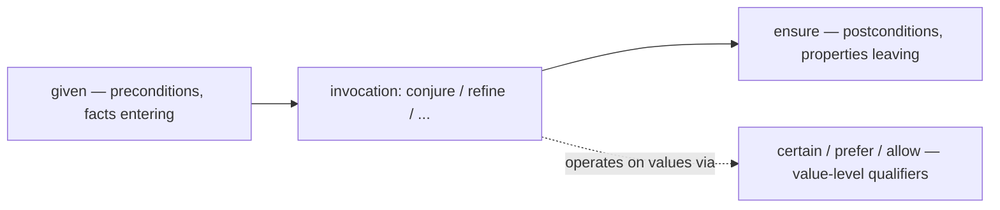
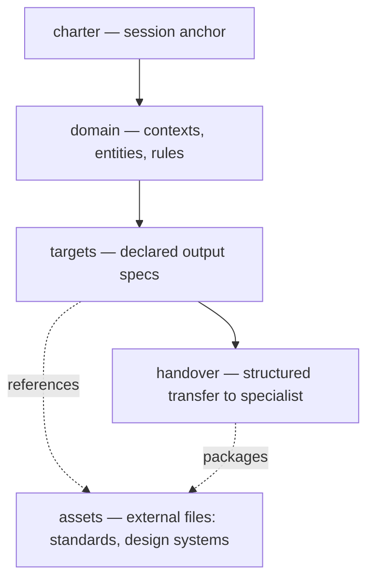

# core.md — Conjurer Core Grimoire

The foundational spellbook. Every Conjurer program draws from this grimoire,
whether it manifests a REST API, analyses a legal document, or orchestrates a
multi-stage data pipeline. `core` provides the language itself: the constructs
for expressing intent, accumulating context, composing operations, and engaging
the system as a collaborator rather than an executor.

---

## Philosophy

The deep philosophical foundation lives in [`conjurer.md`](../conjurer.md).
This section positions what `core` specifically contributes: the vocabulary
of intent.

Every other grimoire provides domain-specific capabilities — `domain` for
knowledge extraction, `web` for front-end generation, `semantics` for textual
analysis. `core` provides something different: the *meta-capabilities* that
make all the others composable. It answers the questions no domain grimoire
can answer alone: How do I describe what I want? How do I refine it? How do
I establish shared understanding? How do I compose operations into workflows?
How do I handle failure gracefully? How do I make the system's reasoning
visible to me?

The answer to each question is a construct in this grimoire.

---

## Construct map

The grimoire is organised into seven thematic parts. Each part addresses a
distinct concern; together they form the complete core vocabulary.

| Part | Theme                          | Constructs                                                              |
|------|--------------------------------|-------------------------------------------------------------------------|
| I    | Fundamental invocations        | `conjure` · `refine` · `context` · `using` · `assume`                   |
| II   | Composition and transformation | `ritual` · `~>` · `transmute` · `weave` · `lore` · `spell` · `charm` · `incantation` |
| III  | Execution primitives           | `sequence` · `parallel` · `branch` · `retry` · `intercept` · `ward`     |
| IV   | Certainty and contracts        | `certain` · `prefer` · `allow` · `given` · `ensure`                     |
| V    | Semantic typing                | `shape`                                                                 |
| VI   | Reflection and perspective     | `explain` · `meta-query` · `witness` · `as`                             |
| VII  | Session and ecosystem          | `charter` · `target` · `asset` · `handover` · `materialise` · `grimoire` |

A practitioner rarely needs every construct in a single session. Most
programs draw heavily from Parts I and II; the rest are summoned when the
session demands them — execution control for production workflows, certainty
qualifiers for high-stakes specifications, ecosystem constructs when work
must persist across sessions or be handed off to specialist agents.

Unlike every other grimoire, `core` constructs carry **no namespace prefix**.
A domain construct is `d/explore`, a web construct is `w/prototype` — but the
core constructs are simply `conjure`, `refine`, `~>`, `ward`. This is
deliberate: core is the language itself, not a library within it. Its
constructs read as keywords of Conjurer rather than as calls into a grimoire,
and prefixing them would imply they are optional in the way a domain library
is. They are not.

---

## Part I: Fundamental invocations

The five fundamental invocations — `conjure`, `refine`, `context`, `using`,
and `assume` — form the irreducible core of every Conjurer session.

---

### `conjure`

The primary act of manifestation. Describes what should exist; the system
brings it into being.

#### Signature

```clojure
(conjure name-or-description
  :requires  [:non-negotiable-capability ...]
  :forbids   [:prohibited-element ...]
  :prefers   [:preferred-capability ...]
  :style     {:style-preference value ...}
  :deferred  [:future-capability ...]
  :accepts   input-description
  :returns   output-description
  :examples  {input output ...}
  :output    :format-keyword
  :manifest  result-binding)
```

#### Parameters

**`name-or-description`** — What to manifest. A concise name
(`payment-processor`) or a natural-language description
(`"A CSV import tool that validates email addresses and deduplicates rows"`).
Both are valid. The system extracts intent from either form.

**`:requires`** — Load-bearing capabilities. The manifestation is incorrect
without these. When constraints conflict, `:requires` always wins.

**`:forbids`** — Load-bearing prohibitions: the topology's negative space. A
manifestation that contains a forbidden element is incorrect — the same binding
force as a missing `:requires` item, with the opposite sign. Distinct from
`ensure` postconditions (verified after generation) because prohibitions shape
generation up front, and distinct from `lore` anti-patterns (guidance) by
binding force.

**`:prefers`** — Preferred capabilities, applied when feasible. Yield to
`:requires` under constraint. Their absence is acceptable; the absence of a
`:requires` item is not.

**`:style`** — Aesthetic and stylistic guidance. Informs tone, verbosity, and
presentation decisions. Never overrides correctness or compliance.

**`:deferred`** — Capabilities noted for future refinement cycles. Recorded
in the manifestation's documentation but not implemented now. Prevents
premature complexity without losing intent.

**`:accepts`** — Description of expected input.

**`:returns`** — Description of expected output.

**`:examples`** — Concrete input/output pairs. Often more precise than prose
descriptions; the system uses them to calibrate intent for edge cases and
normalisation behaviour.

**`:output`** — Desired output format: `:code`, `:edn`, `:json`, `:markdown`,
`:artefact`, etc.

**`:manifest`** — Binds the result to a name for use in subsequent invocations.
The outer form `(def name (conjure ...))` is equivalent and equally valid:
`def` binds from outside the invocation, `:manifest` from inside. Use
whichever reads better in context — chained work tends to read best with
`def`; a binding that belongs to the invocation's own story reads best as
`:manifest`. The examples in this grimoire use both.

#### Design rationale

Every Conjurer program revolves around `conjure`. Unlike a function call that
invokes an existing procedure, `conjure` describes *what should exist* and
trusts the system to determine *how to create it*.

The topology vocabulary — `:requires`, `:forbids`, `:prefers`, `:style`,
`:deferred` — solves a real design problem: not all parts of a specification
carry equal weight. When the system encounters a tension between a compliance
requirement and a UX preference, it must know which to honour. Without explicit
topology, this is left to inference and is frequently inferred incorrectly. The
vocabulary makes prioritisation explicit — including its negative space:
`:forbids` states what must *not* appear with the same force that `:requires`
states what must.

The `:examples` parameter is frequently more expressive than parameter
descriptions. "What does 'normalise' mean for this data?" is answered more
cleanly by three examples than by a paragraph of prose. Whenever intent is
nuanced, lead with examples.

#### Example 1: Topology-driven specification

```clojure
(conjure payment-processor
  :requires  [:pci-dss-compliance :idempotency :audit-trail]
  :forbids   [:plaintext-pan-at-rest :silent-retries]
  :prefers   [:real-time-fraud-detection :multi-currency-support]
  :style     {:error-messages :user-friendly :logging :structured-json}
  :deferred  [:analytics-hooks :a-b-testing-framework]
  :manifest  payment-processor)

;; ✓ PCI-DSS, idempotency, audit trail: always present — non-negotiable
;; ✗ Plaintext PANs at rest, silent retries: never present — equally non-negotiable
;; ✓ Fraud detection, multi-currency: present when feasible within constraints
;; → Analytics and A/B testing: documented, not implemented yet
```

#### Example 2: Intent expressed by example

```clojure
(conjure address-normaliser
  :accepts  raw-address-string
  :returns  {:street string :city string :postcode string :country :iso-3166-alpha-2}
  :examples {
    "12 market street, springfield"
    {:street "12 Market Street" :city "Springfield" :postcode nil :country nil}

    "baker street 221b london"
    {:street "221B Baker Street" :city "London" :postcode nil :country "GB"}}
  :style    {:casing :title-case :missing-fields nil})

;; The examples communicate normalisation behaviour precisely:
;; title-casing, field extraction, graceful nil for missing postcode and
;; unresolvable country, ISO country codes where inferable, and tolerance of
;; unconventional input ordering ("baker street 221b" → "221B Baker Street").
```

#### Example 3: Business process

```clojure
(conjure order-fulfillment
  :triggers  (order :status :paid)
  :requires  [:inventory-reservation :payment-capture :saga-compensation]
  :steps     [
    {:verify-inventory  :abort-if-insufficient}
    {:reserve-items     :compensate-on-failure}
    {:capture-payment   :retry-3-times}
    {:initiate-shipping :notify-customer}]
  :deferred  [:carrier-selection-optimisation :route-planning]
  :manifest  fulfillment-workflow)
```

#### Usage patterns

```clojure
;; Direct manifestation with natural-language description
(conjure "PDF invoice generator"
  :template company-letterhead
  :data     order-data
  :output   :pdf-bytes)

;; Chained conjurations — each builds on the previous result
(def domain   (conjure domain-model    :from requirements-docs))
(def api      (conjure rest-api        :from-domain domain))
(def frontend (conjure admin-panel     :from-api api))

;; Semantic equivalence — all three produce the same validator
(conjure user-form :validates [:email-format :age-minimum :password-strength])
(conjure user-form :ensures   [:valid-email :legal-age :secure-password])
(conjure user-form :requires  {:email :valid-format :age {:at-least 18}})
```

---

### `refine`

Iteratively enhances an existing manifestation. Adds capability, adjusts
parameters, removes elements, or deepens analysis — without starting over.

#### Signature

```clojure
(refine existing-manifestation
  :focus-on [:aspect ...]
  :add      [:capability ...]
  :adjust   {:parameter new-value ...}
  :without  [:capability-to-remove ...]
  :deepen   :by n-levels
  :when     predicate
  :manifest refined-result)
```

#### Parameters

**`existing-manifestation`** — The artefact to enhance.

**`:focus-on`** — Narrows refinement to specific aspects. Without it, the
entire manifestation is refined. With it, only the named aspects change —
everything else is preserved intact.

**`:add`** — Capabilities to introduce.

**`:adjust`** — Parameter modifications to apply.

**`:without`** — Capabilities to remove. The explicit counterpart to `:add`;
makes removal intentional and visible rather than accidental and implicit.

**`:deepen`** — Adds hierarchical levels of detail to the focused aspect.
Deepening by 2 means two additional layers of decomposition or analysis.

**`:when`** — A predicate or condition. When present, the refinement is
*conditional*: it applies only when the predicate holds. Enables
aspirationally complete specifications — future refinements recorded in
dormant form, activated when conditions are met.

**`:manifest`** — Binds the refined result.

#### Design rationale

Complex systems do not arrive fully formed. Neither does understanding of
them. `refine` formalises the iterative nature of real work: conjure a sketch,
see what emerges, sharpen specific aspects, repeat.

The deeper insight is that `refine` is a *discovery tool* as much as an
enhancement mechanism. The first manifestation of an underspecified intent
becomes a mirror — the practitioner sees what the system understood, which
often reveals what they actually wanted but had not yet articulated. Refinement
is how understanding develops, not just how implementations improve.

The `:without` parameter addresses an important gap. If `:add` exists, its
counterpart must too. Artefacts that can only grow but never shed accumulate
dead weight. Making removal explicit and intentional keeps manifestations
honest.

The `:when` predicate enables *aspirational completeness*: a specification
that contains future refinements in dormant form. The practitioner records
what they know will be needed — before they know they need it — and the
refinement activates automatically when conditions are met.

#### Example 1: Focused, surgical refinement

```clojure
(refine checkout-flow
  :focus-on :payment-step
  :add      [:3ds2-strong-authentication :tokenised-card-storage]
  :adjust   {:session-timeout 300 :max-retry-attempts 3}
  :without  [:legacy-iframe-payment-form]
  :manifest hardened-checkout)

;; Cart step and confirmation step: untouched
;; Payment step: surgically enhanced
;; Legacy iframe: explicitly removed — not left as silent dead code
```

#### Example 2: Conditional refinement

```clojure
(refine api-layer
  :focus-on :rate-limiting
  :add      [:sliding-window-algorithm :per-endpoint-quotas :redis-backed-counters]
  :when     (> projected-rps 500))

;; At modest scale: rate limiting is deferred — no premature complexity
;; When projections exceed 500 rps: this refinement activates automatically
;; The intent is recorded now; the implementation arrives when needed
```

#### Example 3: Analysis deepening

```clojure
(def overview
  (conjure domain-exploration :source "gdpr-guidance.pdf" :depth 2))

(refine overview
  :focus-on "data-subject-rights"
  :deepen   :by 3
  :add      [:enforcement-precedents :national-implementation-variations]
  :manifest rights-deep-dive)

;; overview: unchanged — still the full shallow exploration
;; rights-deep-dive: full depth on data-subject-rights subtree only
```

---

### `context`

Establishes semantic context — the shared understanding that shapes how all
subsequent invocations in its scope are interpreted.

#### Signature

```clojure
(context name
  :inherits    parent-context-name
  :domain      :domain-keyword
  :entities    {:entity-name [:attribute ...] ...}
  :conventions {:convention-name value ...}
  :regulations [:regulation ...]
  :assumptions ["natural-language assumption" ...]
  :active-in   :session | :block)
```

#### Parameters

**`name`** — Names this context for reference in `:inherits` clauses and
`using` blocks.

**`:inherits`** — A previously established context to extend. The new context
inherits all of its parent's definitions; additions and overrides apply on
top. Extends the inherited regulations list rather than replacing it.

**`:domain`** — The subject domain. Sets the semantic field for all
interpretation: vocabulary, implicit standards, reasonable defaults.

**`:entities`** — Key entities and their attributes. Defined once here; need
not be re-specified in subsequent invocations.

**`:conventions`** — Agreed standards, naming patterns, encoding choices. What
the team has decided the system should honour automatically.

**`:regulations`** — Applicable compliance requirements. Named regulations
activate implied behaviours: GDPR activates data-minimisation and
right-to-erasure handling; PSD2 activates strong-customer-authentication;
HIPAA activates PHI protection and audit logging on all PHI access.

**`:assumptions`** — Things the practitioner takes for granted that the system
should too. Making assumptions visible makes them inspectable and correctable.

**`:active-in`** — `:session` (entire conversation) or `:block` (until
explicitly closed, or when the enclosing `using` block exits).

#### Design rationale

An LLM is fundamentally a context machine. The same word means different
things in different domains: "patient" in healthcare is a clinical subject;
in a service-quality discussion, it is a virtue. Context resolves this — not
by restricting vocabulary, but by establishing the semantic field in which all
words are interpreted.

The `:inherits` parameter turns contexts from isolated declarations into a
*hierarchy*. A base service context establishes shared conventions — error
format, authentication mechanism, date standard — and a payment-specific
context inherits those, adding financial regulations without re-declaring
the shared parts. When the base changes, all inheriting contexts update.

The consequence of well-established context is *semantic gravity*: the heavier
the context, the shorter and more precise subsequent invocations become. A
practitioner who has established a rich HIPAA context does not write
compliance requirements into every `conjure` — they write only what is
*different* about this invocation. The context handles the rest.

#### Example 1: Inherited context hierarchy

```clojure
;; Base: shared across all services in the platform
(context platform-base
  :conventions {:error-format   :rfc-7807
                :auth           :jwt-bearer
                :date-format    :iso-8601
                :correlation-id :required-in-all-requests}
  :regulations [:gdpr]
  :active-in   :session)

;; Payment: inherits base, extends with financial domain
(context payments
  :inherits    platform-base
  :domain      :financial-services
  :regulations [:psd2 :aml-kyc]           ;; extends [:gdpr], does not replace it
  :entities    {:transaction [:id :amount :currency :timestamp :status]
                :account     [:id :balance :currency :risk-rating]}
  :conventions {:currency         :eur
                :amount-precision 2
                :idempotency-key  :required})

;; All subsequent payment invocations carry the full stack automatically:
;; RFC-7807 errors, JWT auth, ISO-8601 dates, GDPR + PSD2 + AML, EUR default.
(conjure payment-processor)   ;; fully specified through accumulated gravity
(conjure refund-handler)      ;; ditto — no repetition required
```

#### Example 2: Healthcare context

```clojure
(context clinical
  :domain      :healthcare
  :entities    {:patient   [:id :mrn :dob :phi-flag]
                :provider  [:id :specialty :license-number]
                :encounter [:id :timestamp :icd-10-codes :facility-id]}
  :regulations [:hipaa :hitech]
  :conventions {:phi-handling   :encrypted-at-rest-and-in-transit
                :audit-logging  :all-phi-access-events
                :data-retention "7 years minimum"}
  :assumptions [
    "All patient data is PHI unless explicitly marked otherwise"
    "Minimum-necessary standard applies to every data access"
    "Patient consent is required before any third-party data sharing"])
```

---

### `using`

Applies an established context or imported namespace to a scoped block of
invocations. Context within a `using` block does not leak outward.

#### Signature

```clojure
(using context-name-or-namespace
  invocation-1
  invocation-2
  ...)
```

#### Design rationale

Context often applies to a group of related invocations, not an entire
session. `using` makes scope explicit: the reader sees exactly which
invocations are governed by which context, and changes to one context cannot
accidentally affect invocations in another scope.

The same mechanism activates domain-specific languages generated by
`d/generate-dsl`. When a domain exploration yields a specialised vocabulary,
`using` makes it available for a specific block without polluting the global
namespace.

#### Example 1: Scoped financial conventions

```clojure
(context dcf-model
  :conventions {:compounding :continuous
                :day-count   :actual-360
                :rounding    2})

(using dcf-model
  (conjure npv-calculator
    :cash-flows    [-500000 120000 145000 170000 200000]
    :discount-rate 0.09)

  (conjure sensitivity-analysis
    :variable      :discount-rate
    :range         [0.06 0.07 0.08 0.09 0.10 0.11 0.12]
    :output-metric :npv))

;; Both invocations use continuous compounding, actual/360 day count.
;; Invocations outside this block are unaffected.
```

#### Example 2: Generated DSL activation

```clojure
(def trade-dsl
  (d/generate-dsl fixed-income-domain
    :operations [:yield :duration :convexity :dv01 :pv01]
    :notation   [:bp :bps :par]))

(using trade-dsl
  (calculate   (dv01 bond-portfolio :parallel-shift-bp 1))
  (solve-for   (yield bond :given {:price 98.75}))
  (present-value future-cashflows :at forward-curve :day-count :actual-365))
```

---

### `assume`

Declares operative constraints — the practitioner's taken-for-granted
assumptions about environment, scale, team, and feasibility. Distinct from
`context`, which defines the domain; `assume` defines the conditions under
which manifestations must actually work.

#### Signature

```clojure
(assume
  :environment    :keyword
  :scale          description
  :team           {:size n :skill-level :keyword}
  :infrastructure {:existing [...] :avoid [...]}
  :constraints    {:budget :keyword :timeline description}
  :negotiable     [:aspect ...]
  :non-negotiable [:aspect ...])
```

#### Design rationale

Every manifestation is shaped by invisible assumptions. A system unaware that
the team has three engineers might propose a twelve-service microarchitecture.
A system unaware of a bootstrapped budget might propose an enterprise
observability stack. These are not wrong manifestations — they are
manifestations for a different reality than the one the practitioner inhabits.

`assume` makes operative reality explicit. Once stated, assumptions are
inspectable via `meta-query`, overridable when circumstances change, and
available to reason about trade-offs explicitly.

The `:non-negotiable` list functions like `:requires` on a `conjure`, but at
the session level: it establishes a hard floor beneath every manifestation in
the session — things the system must never trade away regardless of other
pressures.

#### Example

```clojure
(assume
  :environment    :production-saas
  :scale          "8K daily active users, growing ~15% monthly"
  :team           {:size 3 :skill-level :senior-generalist}
  :infrastructure {:existing [:postgres :aws-ec2 :cloudflare :sendgrid]
                   :avoid    [:kubernetes :separate-message-broker]}
  :constraints    {:budget :bootstrapped :timeline "4 months to public launch"}
  :negotiable     [:ui-framework :background-job-runner :caching-strategy]
  :non-negotiable [:gdpr-compliance :zero-downtime-deploys :encryption-at-rest])

;; The system will not propose Kafka.
;; The system will not assume a DevOps engineer exists.
;; The system will not design for 10M users.
;; GDPR, zero-downtime, and encryption appear in every manifestation
;; without being re-stated.
```

---

## Part II: Composition and transformation

These constructs describe how Conjurer programs are *structured*: how
data flows through a pipeline, how multi-phase work is organised into
deliberate steps, how forms change while essence is preserved, how
independent components are integrated into coherent systems, and how
domain wisdom is encoded for reuse.

The last three constructs of this part — `spell`, `charm`, and
`incantation` — are the language's abstraction layer: naming a reusable
invocation pattern, casting one anonymously inside a pipeline, and
generating whole families of invocations from a single deterministic
expansion.

---

### `ritual`

A structured, multi-phase invocation that guides the system through deliberate
sequential steps, accumulating intermediate artefacts at each stage.

#### Signature

```clojure
(ritual name
  :phases [
    {:name    :phase-name
     :do      invocation
     :produce :artefact-name}
    ...]
  :checkpoint :after-each-phase | :on-completion
  :manifest   final-result)
```

#### Design rationale

Some manifestations are too complex for a single `conjure` — the final
artefact depends on intermediate discoveries that cannot be known upfront. A
ritual makes the multi-step nature explicit: each phase produces an artefact
the next phase consumes, and the accumulation of intermediate work is itself
part of the value.

A ritual also documents *process*, not just outcome. It communicates not only
what should be produced but what sequence of reasoning should produce it —
making the approach inspectable, reproducible, and teachable.

#### Example

```clojure
(ritual design-api
  :phases [
    {:name    :discover
     :do      (d/explore requirements-docs :depth 3 :focus [:entities :operations])
     :produce :domain-model}

    {:name    :model
     :do      (conjure resource-model
                :from   domain-model
                :apply  [:rest-constraints :hateoas-links])
     :produce :resource-map}

    {:name    :specify
     :do      (conjure endpoint-specs :for-each resource-in resource-map
                :include [:methods :parameters :error-responses :examples])
     :produce :api-spec}

    {:name    :validate
     :do      (conjure openapi-doc :from api-spec :validate :openapi-3.1)
     :produce :validated-openapi}]

  :checkpoint :after-each-phase
  :manifest   api-specification)

;; Each phase is inspectable before the next begins.
;; :checkpoint :after-each-phase means the system pauses and reports,
;; allowing course-correction before continuing.
```

---

### `~>` — Threading

Composes a sequence of transformations into a readable left-to-right pipeline.
The result of each expression becomes the implicit first argument to the next.

#### Signature

```clojure
(~> initial-value
  (operation-1 :param value)
  (operation-2 :param value)
  ...)
```

#### Design rationale

Deep nesting is the enemy of readability. Without threading, a multi-step
pipeline reads inside-out — the last transformation appears outermost, the
first is buried deepest. The reader must mentally reverse the order to
understand the data flow.

`~>` makes data flow linear. The eye follows the transformation downward,
step by step, in the order transformations actually occur. The pipeline *is*
the program; intent is not hidden in nesting.

`~>` also enables clean insertion of `witness` calls at any stage without
restructuring surrounding code. Observability becomes frictionless.

#### Example 1: Document to deliverable

```clojure
(~> "contract-nda-2024.pdf"
  (d/explore   :depth 3 :focus [:obligations :termination :liability-caps])
  (s/texan     :models [:argumentation :risk :legal-structure])
  (conjure risk-summary
    :highlight [:uncapped-liability :auto-renewal-clauses :ip-assignment]
    :omit      [:boilerplate]
    :output    :executive-summary)
  (e/compose   :tone :precise :audience :legal-counsel :length :concise))

;; PDF → domain model → semantic analysis → risk summary → formatted output
;; Each step independently inspectable; any step replaceable without
;; touching the rest of the pipeline.
```

#### Example 2: Data engineering

```clojure
(~> "transactions-q4.csv"
  (conjure loader   :validate [:schema :referential-integrity :date-ranges])
  (conjure cleanser :operations [:deduplicate :normalise-amounts :fill-missing])
  (conjure enricher :add [:merchant-category :geographic-region :risk-band])
  (witness (conjure scorer :model :gradient-boosted)
    :observe   [:feature-importance :score-distribution]
    :record-to model-audit-trail)
  (conjure reporter :format :executive-summary :output :pdf))
```

#### Example 3: Cross-grimoire product pipeline

```clojure
(~> legacy-database-schema
  (d/explore       :focus [:entities :relationships :constraints :indexes])
  (data/schema     :from-domain true :normalise true :validate true)
  (conjure migration-plan
    :strategy   :zero-downtime
    :rollback   :automated
    :validate-parity :strict)
  (w/prototype "Admin Panel"
    :from-domain true
    :features    [:crud-for-all-entities :filtering :bulk-export :audit-log-viewer]))

;; Legacy schema → understood domain → clean data contract →
;; migration plan → admin UI prototype.
;; Four grimoires; one readable pipeline.
```

---

### `transmute`

Transforms an existing manifestation into a structurally different form while
preserving its semantic essence. Where `refine` enhances the same form, and
`conjure` creates from scratch, `transmute` changes form while conserving
meaning.

#### Signature

```clojure
(transmute source-manifestation
  :into       :target-form
  :preserving [:semantic-aspect ...]
  :discarding [:structural-aspect ...]
  :style      :descriptor
  :manifest   result-binding)
```

#### Design rationale

Software knowledge exists in multiple equivalent representations. A domain
model can become a REST API, a database schema, a UI wireframe, or a test
suite. A requirements document can become user stories, a deployment checklist,
or an OpenAPI specification. These are not reimplementations — they are
*recastings* of the same knowledge into forms suited to different purposes.

Without `transmute`, each new form must be conjured from scratch, re-specifying
everything the original already encodes. With it, the existing manifestation
*is* the specification. Knowledge is stated once; forms multiply from it.

`:preserving` items are semantic content that survives the transformation.
`:discarding` items are structural artefacts of the source form that do not
transfer to the target.

#### Example 1: One domain model, three forms

```clojure
(def crm-domain (d/explore crm-documentation :depth 4))

(transmute crm-domain
  :into       :rest-api
  :preserving [:entities :relationships :business-rules]
  :discarding [:ui-presentation-hints :screen-flow-metadata]
  :manifest   crm-api)

(transmute crm-domain
  :into       :database-schema
  :preserving [:entities :constraints :relationships]
  :style      :third-normal-form
  :manifest   crm-schema)

(transmute crm-domain
  :into       :test-suite
  :preserving [:business-rules :invariants :edge-cases]
  :discarding [:implementation-details :infrastructure-choices]
  :manifest   crm-tests)

;; Three artefacts from one source of truth.
;; When the domain model changes, each can be re-transmuted.
```

#### Example 2: Requirements to development artefacts

```clojure
(~> (d/explore "product-requirements-v4.pdf" :depth 3)
  (transmute :into :user-stories
    :preserving [:user-goals :acceptance-criteria]
    :style      :gherkin-given-when-then)
  (transmute :into :engineering-tasks
    :preserving [:acceptance-criteria :technical-constraints]
    :style      :t-shirt-sized-with-dependencies)
  (transmute :into :test-plan
    :preserving [:acceptance-criteria :edge-cases :performance-requirements]
    :style      :bdd))
```

---

### `weave`

Integrates multiple independent manifestations into a coherent system. Where
`sequence` describes *order of operations*, `weave` describes *relationships
between coexisting things*. It is the difference between a recipe and an
architecture.

#### Signature

```clojure
(weave name
  :strands      [manifestation ...]
  :integrations [
    {:from     source-strand
     :to       target-strand-or-strands
     :via      integration-pattern
     :contract {:requirement value ...}}
    ...]
  :ensuring     [:system-level-property ...]
  :surface      surface-specification
  :manifest     result-binding)
```

#### Design rationale

Real systems are not sequences of operations — they are ecosystems of
coexisting components. `sequence` and `parallel` compose operations in *time*.
`weave` composes artefacts in *space*: it specifies the connections between
things, the contracts those connections must honour, and the system-level
properties that must hold across the whole.

A woven system is more than the sum of its strands. The integration contracts,
the system-level invariants, and the unified surface emerge from the weaving —
they do not exist in any individual strand.

#### Example

```clojure
(weave e-commerce-platform
  :strands [auth-service product-catalog cart-service payment-processor notifications]

  :integrations [
    {:from     auth-service
     :to       [cart-service payment-processor product-catalog]
     :via      :jwt-propagation
     :contract {:token-validation    :on-every-request
                :required-claims     [:user-id :role :session-id]}}

    {:from     cart-service
     :to       payment-processor
     :via      :order-handoff
     :contract {:idempotency-key     :required
                :amount-verification :strict
                :inventory-lock      :must-be-held}}

    {:from     payment-processor
     :to       notifications
     :via      :event-bus
     :contract {:events              [:payment-succeeded :payment-failed :refund-issued]
                :delivery-guarantee  :at-least-once
                :max-latency         "30 seconds"}}]

  :ensuring [:no-orphaned-transactions
             :unified-error-taxonomy
             :eventual-consistency-across-services
             :single-audit-trail]

  :surface  {:entry-point :api-gateway
             :auth        :single-sign-on
             :docs        :unified-openapi-spec}

  :manifest platform-architecture)
```

---

### `lore`

Encodes accumulated domain wisdom as a named, reusable pattern library. Where
`context` establishes structural facts, `lore` encodes *behavioural patterns*:
learned heuristics, design idioms, and active anti-patterns specific to a
domain.

#### Signature

```clojure
(lore name
  :observed-in   [sources ...]
  :patterns      [
    {:name      :pattern-name
     :when      "condition"
     :apply     "pattern description"
     :rationale "why it matters"}
    ...]
  :anti-patterns [
    {:name    :anti-pattern-name
     :avoid   "condition"
     :because "reason"}
    ...]
  :active-in     :scope)
```

#### Design rationale

Expertise is not just knowing a domain — it is knowing its *idioms*. An expert
in financial systems doesn't just know that idempotency matters; they know that
idempotency keys must be generated on the *client* before the request, not on
the server, because network failures occur between generation and receipt.

This knowledge rarely appears in formal documentation. It accumulates through
experience and post-mortems. `lore` gives tacit expertise a place to live in
Conjurer, making it available to every subsequent invocation within its scope
— applied as internalised knowledge, not post-hoc annotation.

#### Example

```clojure
(lore payment-system-patterns
  :observed-in ["stripe-engineering-blog" "psd2-eba-guidance" "incident-retrospectives"]

  :patterns [
    {:name      :client-side-idempotency-keys
     :when      "any state-mutating payment operation"
     :apply     "Generate the idempotency key on the client before the request;
                 validate server-side before processing."
     :rationale "Network failures occur between key generation and request receipt.
                 Server-side generation creates duplicate-charge risk on retry."}

    {:name      :amounts-in-minor-units
     :when      "any monetary amount stored or transmitted"
     :apply     "Represent as integer minor units (cents, pence);
                 never floating-point."
     :rationale "Float arithmetic introduces rounding errors that compound
                 across aggregations and currency conversions."}

    {:name      :sca-before-authorisation
     :when      "European payment flow under PSD2"
     :apply     "Complete strong customer authentication before the
                 authorisation request, not after."
     :rationale "PSD2 requires SCA to cover the specific transaction
                 amount and payee. Post-auth SCA does not satisfy this."}]

  :anti-patterns [
    {:name    :optimistic-inventory-decrement
     :avoid   "Decrementing inventory before payment confirmation"
     :because "Payment failures leave inventory counts permanently incorrect."}

    {:name    :synchronous-email-in-checkout
     :avoid   "Sending confirmation email synchronously in the checkout path"
     :because "Email provider outages should never cause payment failures.
               Async dispatch via event bus is always preferred."}]

  :active-in :session)
```

---

### `spell`

Defines a named, parameterised, reusable invocation pattern. Where `conjure`
manifests once, `spell` captures the *shape* of a manifestation so it can be
cast again and again — the language's `defn`, in the lineage the name has
always promised.

#### Signature

```clojure
(spell name [parameters & {:keys [named-parameters] :or {defaults}}]
  :doc "what this spell manifests and which defaults it bakes in"
  body-invocation)
```

#### Parameters

**`name`** — The spell's name. Casting the spell is applying the name:
`(name args ...)`.

**`parameters`** — Positional and named parameters, Clojure-style, with
optional defaults. Caller arguments arrive in the body as *leanings* —
equivalent to `(prefer v)` — unless the caller wraps them in `certain`. A
spell never silently upgrades a caller's commitment.

**`:doc`** — What the spell manifests and, importantly, which defaults it
front-loads. A spell is a contract with its future callers; the doc is where
that contract is stated.

**`body-invocation`** — Any invocation form: a `conjure`, a `~>` pipeline, a
`ritual`. Parameters are available throughout.

#### Design rationale

A practitioner who writes the same `conjure` shape twenty times has been
carrying an abstraction in their head with no way to put it in the language.
`spell` is that way. It is semantic gravity made portable: a spell front-loads
the invariant part of an invocation — the compliance defaults, the style
guidance, the contracts — into a named, reusable form, so each cast carries
only the delta, exactly as a mature context lets invocations grow shorter.

Two semantics are deliberate. First, *certainty is caller-owned*: arguments
arrive as leanings unless the caller marks them `certain`, because the person
casting the spell — not the person who wrote it — knows how committed the
value is. Second, *context is captured at the invocation site*: a spell cast
inside a healthcare context inherits that context's gravity, not the gravity
of wherever the spell happened to be defined. A spell is a pattern, not a
sealed environment.

#### Example

```clojure
(spell compliant-endpoint [entity & {:keys [audience] :or {audience :engineer}}]
  :doc "REST endpoint with the team's compliance defaults baked in"
  (conjure (str entity "-endpoint")
    :requires [:audit-trail :idempotency :pci-compliance]
    :forbids  [:silent-retries]
    :style    {:error-messages :user-friendly}
    :within   (ensure :semantic ["errors never leak internal identifiers"])))

;; Twenty invocations later, each is one line, and the compliance
;; defaults live in exactly one place:
(compliant-endpoint transaction)
(compliant-endpoint refund :audience :compliance-officer)

;; A caller who has genuinely decided marks it so:
(compliant-endpoint settlement :audience (certain :regulator))
```

#### Usage patterns

```clojure
;; Spells compose like any invocation — inside pipelines, wards, rituals:
(~> quarterly-close
  (compliant-endpoint)
  (e/compose :audience :executive))

;; Refine the spell, not the twenty casts: every future cast inherits it
(refine compliant-endpoint
  :add     [:structured-logging]
  :because "Incident review 2026-06: unstructured logs slowed triage")
```

---

### `charm`

An anonymous, single-use invocation — `spell`'s unnamed twin, as `fn` is to
`defn`. Earns its keep inside `~>` pipelines, where a step needs to receive
the threaded value under a name.

#### Signature

```clojure
(charm [threaded-value-name]
  body-invocation)
```

#### Design rationale

Most of what a charm does, an inline `conjure` already does — a charm is
convenience, not capability, and the spec is honest about that. The one place
it is genuinely needed is a pipeline step that must *name* the value flowing
through it: `~>` threads results positionally, and until `charm`, a step that
wanted to use the threaded value twice, or somewhere other than first
position, had no expression. A charm should stay small; a charm complex
enough to deserve documentation deserves a name, and a name makes it a
`spell`.

#### Example

```clojure
(~> quarterly-dataset
  (data/profile :detect [:drift :anomalies])
  (charm [profile]                             ;; the threaded value, named
    (conjure anomaly-note
      :from     profile
      :severity (:worst-anomaly profile)       ;; used twice — needs the name
      :output   :markdown))
  (e/compose :audience :executive :tone :measured))
```

---

### `incantation`

A macro: an invocation that generates invocations. Expansion is deterministic
and inspectable *before* anything is manifested — the plan/act separation the
language already enforces in `materialise`, applied to abstraction.

#### Signature

```clojure
(incantation name [parameters]
  :doc        "what family of invocations this generates"
  :expands-to (generating-expression))       ;; deterministic — no manifestation here

;; Casting:
(name args :expand :preview)   ;; phase 1 — show the exact invocations, run nothing
(name args)                    ;; phase 2 — execute the expansion
```

#### Parameters

**`:expands-to`** — A deterministic expression over the incantation's
parameters that produces a sequence of invocations. Expansion may reference
only its parameters and constructs already registered in the session — never
perform manifestation itself. An incantation may generate spells and
invocations; it may not generate other incantations.

**`:expand :preview`** — Mandatory-available preflight: the exact list of
invocations that *would* run, with their arguments resolved. Nothing is
generated.

#### Design rationale

The classic objection to macros is opaque expansion: code runs that nobody
ever saw. Conjurer already owns the answer, in a ground truth: *separate the
deterministic plan from the generative act, and verify the first before
risking the second.* Expansion is the deterministic, lossless, checkable
half — which invocations, with which arguments — so it runs as an inspectable
preflight, exactly like `materialise`'s plan phase. Only against an expansion
already seen to be sound is the generative half executed. Generating against
an unverified expansion would be the abstraction-layer form of generating
against an unverified plan, and the remedy is the same: structural, not
careful.

The restriction that incantations cannot generate incantations is a
deliberate v1 boundary: one level of expansion keeps every preview flat and
fully readable. It can be revisited if practice demands it.

#### Example

```clojure
(incantation crud-suite [model]
  :doc "One endpoint family per entity in a domain model"
  :expands-to
    (for [entity (entities-of model)]
      (compliant-endpoint entity
        :handles [:create :read :update :delete])))

;; Phase 1 — deterministic, lossless, checkable:
(crud-suite insurance-domain :expand :preview)
;; => (compliant-endpoint policy   :handles [:create :read :update :delete])
;;    (compliant-endpoint claim    :handles [:create :read :update :delete])
;;    (compliant-endpoint insured  :handles [:create :read :update :delete])
;; Inspect the plan; refine the model or the incantation if it is wrong.

;; Phase 2 — generative, lossy, irreversible:
(crud-suite insurance-domain)
```

---

## Part III: Execution primitives

The execution primitives describe how operations *relate and combine*.
Where the constructs of Part II compose artefacts in structure and form,
execution primitives compose them in time and behaviour: ordering,
concurrency, conditionality, resilience, cross-cutting concerns, and
graceful failure.

---

### `sequence`

Executes operations in order, passing results from each to the next.

#### Signature

```clojure
(sequence name
  :operations   [op-1 op-2 op-3 ...]
  :pass-results :forward | :accumulate | :selective
  :on-error     :stop | :continue | :compensate
  :manifest     result-binding)
```

#### Parameters

**`:pass-results`** — `:forward`: each operation receives the previous result.
`:accumulate`: each operation receives all prior results as a collection.
`:selective`: explicit bindings specify what each operation receives.

**`:on-error`** — `:stop`: halt on first failure. `:continue`: skip failed
operations, proceed with remaining. `:compensate`: on failure, execute
registered compensating operations in reverse order (saga pattern).

#### Design rationale

Sequential execution is the most fundamental composition pattern — later
operations depend on earlier results. `sequence` makes these dependencies
explicit while managing result-passing and error propagation automatically.

The three `:pass-results` modes address real diversity in how sequential
workflows actually work. Simple pipelines pass the most recent result forward.
Analysis workflows need every prior result for comprehensive synthesis. Complex
workflows need selective access to specific earlier outputs.

#### Example 1: Data pipeline

```clojure
(sequence customer-insights
  :operations [
    (conjure loader   :source "transactions.csv" :validate [:schema :completeness])
    (conjure cleanser :operations [:deduplicate :normalise :fill-missing])
    (conjure enricher :add [:merchant-category :geographic-region :risk-band])
    (conjure analyser :compute [:aggregates :trends :anomalies])
    (conjure reporter :format :executive-summary :output :pdf)]
  :pass-results :forward
  :on-error     :stop
  :manifest     insights-report)
```

#### Example 2: Saga with compensation

```clojure
(sequence order-saga
  :operations [
    (conjure reserve-inventory :items order-items
      :compensate :release-reservation)
    (conjure authorise-payment :amount total :method card
      :compensate :void-authorisation)
    (conjure send-confirmation :to customer-email
      :compensate :send-cancellation-notice)
    (conjure initiate-shipment :order order-id
      :compensate :cancel-with-carrier)]
  :pass-results :selective
  :on-error     :compensate
  :manifest     order-result)

;; If initiate-shipment fails after all prior steps succeeded,
;; compensation runs in reverse: cancel-with-carrier is skipped
;; (shipment never started), send-cancellation-notice, void-authorisation,
;; release-reservation. Clean, automatic rollback.
```

#### Example 3: Accumulating analysis

```clojure
(sequence contract-review
  :operations [
    (conjure extract-parties     :from contract :types [:signatories :indemnified])
    (conjure extract-obligations :from contract :categorise [:payment :delivery :ip])
    (conjure assess-risk         :considering [:parties :obligations])
    (conjure generate-redlines   :based-on [:parties :obligations :risks]
      :flag [:uncapped-liability :auto-renewal :unilateral-amendment-rights])]
  :pass-results :accumulate    ;; each stage sees all prior results
  :manifest     review-report)
```

---

### `parallel`

Executes operations concurrently, collecting and combining results.

#### Signature

```clojure
(parallel name
  :operations      [op-1 op-2 ...]
  :combine-results :merge | :array | :synthesise | custom-charm
  :wait-for        :all | :any | :first-n
  :timeout         duration-ms
  :on-error        :fail-fast | :collect-errors | :best-effort
  :manifest        result-binding)
```

#### Parameters

**`:wait-for`** — `:all`: wait for every operation. `:any`: return when the
first completes; cancel remaining. `:first-n`: return when N operations have
completed — useful for quorum or consensus patterns.

**`:on-error`** — `:fail-fast`: fail immediately if any operation fails.
`:collect-errors`: gather all errors before failing; surface them together.
`:best-effort`: return successful results alongside an error report for failed
ones — partial results are often better than no result.

#### Design rationale

Independent operations have no reason to execute sequentially. Network calls,
external API requests, document analyses, and validation checks that share no
dependencies are natural candidates for concurrency. `parallel` exploits this
independence while managing the complexity of concurrent execution, result
collection, and error handling.

The `:wait-for :any` mode enables racing strategies — when multiple equivalent
providers exist and latency matters, the first response wins and others are
cancelled. This is a meaningful architectural pattern, not just a performance
trick.

#### Example 1: Data enrichment from independent sources

```clojure
(parallel enrich-user-profile
  :operations [
    (conjure fetch-orders          :from order-service    :user-id uid :limit 10)
    (conjure fetch-preferences     :from settings-service :user-id uid)
    (conjure fetch-recommendations :from ml-service       :user-id uid :count 5)
    (conjure fetch-support-history :from crm-service      :user-id uid)]
  :combine-results :merge
  :wait-for        :all
  :timeout         2000
  :on-error        :best-effort   ;; partial profile beats no profile
  :manifest        dashboard-data)
```

#### Example 2: Racing providers

```clojure
(parallel geocode-address
  :operations [
    (conjure geocode :provider :google :address input-address)
    (conjure geocode :provider :mapbox :address input-address)
    (conjure geocode :provider :here   :address input-address)]
  :wait-for :any      ;; first response wins; others cancelled
  :timeout  3000
  :on-error :collect-errors
  :manifest geocoding-result)
```

#### Example 3: Comprehensive parallel validation

```clojure
(parallel validate-registration
  :operations [
    (conjure validate-schema     :data input :schema user-schema)
    (conjure validate-uniqueness :data input :check [:email :username])
    (conjure validate-security   :data input :check [:injection :xss])
    (conjure validate-business   :data input :rules [:age-of-consent :restricted-regions])]
  :wait-for        :all
  :on-error        :collect-errors    ;; surface all violations, not just the first
  :combine-results (charm [results]
                     (conjure validation-verdict
                       :valid  "true only when every individual check passed"
                       :errors "all violations from all checks, concatenated"))
  :manifest        validation-result)
```

---

### `branch`

Executes operations conditionally based on predicates.

#### Signature

```clojure
(branch name
  :on       predicate-or-value
  :cases    {pattern-1 operation-1
             pattern-2 operation-2
             :else     default-operation}
  :evaluate :eager | :lazy
  :manifest result-binding)
```

#### Parameters

**`:evaluate`** — `:lazy`: only the matching branch executes (correct for
expensive or side-effectful operations). `:eager`: all branches execute; the
result of the matching branch is selected (useful for precomputation or when
all outcomes should be warmed).

#### Design rationale

Decision logic is fundamental: different inputs require different handling;
different states require different responses. `branch` provides declarative
control flow that integrates naturally with Conjurer's composable model.

Pattern matching supports both exact values and predicates, enabling
everything from simple dispatch to multi-factor decision trees. The `:else`
clause provides mandatory default behaviour — unhandled cases are never
silently ignored.

Predicate patterns close over the value under test by convention: `score` in
the cases below denotes the result of `:on`, just as `status` in `retry`'s
`:retry-on` denotes the failure being classified. The binding is implicit,
so choose names that make the referent unmistakable.

#### Example 1: Risk-based routing

```clojure
(branch payment-routing
  :on     (score-transaction transaction)
  :cases  {
    (< score 0.3) (conjure auto-approve    :transaction transaction)
    (< score 0.7) (conjure standard-review :transaction transaction
                   :checks [:velocity :device-fingerprint])
    (< score 0.9) (conjure enhanced-review :transaction transaction
                   :checks :all :include-biometric true)
    :else         (conjure manual-review   :transaction transaction
                   :freeze-account true :notify :fraud-team)}
  :evaluate :lazy
  :manifest routing-decision)
```

#### Example 2: Structural pattern matching

```clojure
(branch support-routing
  :on    incoming-issue
  :cases {
    {:category :technical :severity :critical}
    (conjure escalate :to :senior-engineer :sla "1h" :notify [:eng-lead :on-call])

    {:category :technical :severity :high}
    (conjure assign :to :technical-support :sla "4h")

    {:category :billing :amount (> amount 1000)}
    (conjure assign :to :account-manager :priority :high)

    {:category :billing}
    (conjure assign :to :billing-support)

    :else
    (conjure assign :to :general-queue :consider-ai-triage true)}
  :evaluate :lazy
  :manifest assignment)
```

---

### `retry`

Executes an operation with automatic retry logic for transient failures.

#### Signature

```clojure
(retry name
  :operation     operation
  :attempts      n
  :backoff       :linear | :exponential | :jittered-exponential | custom-charm
  :initial-delay ms
  :max-delay     ms
  :retry-on      [error-predicate ...]
  :give-up-on    [error-predicate ...]
  :on-retry      charm
  :manifest      result-binding)
```

#### Design rationale

Distributed systems fail transiently. Network timeouts, temporary service
unavailability, rate limiting, and lock contention create failures that may
succeed on retry. `retry` implements resilience patterns that distinguish
these from permanent failures that should propagate immediately.

Backoff strategies are not cosmetic. Linear backoff suits known, bounded
recovery times. Exponential backoff reduces pressure on struggling services
progressively. Jittered exponential backoff prevents the thundering herd
problem — when many clients retry simultaneously after a shared outage, jitter
spreads the load across the recovery window.

The `:retry-on` / `:give-up-on` split is essential. Retrying an authentication
failure wastes time and may lock accounts. Retrying a network timeout is
almost always correct. Making this distinction explicit — requiring the
practitioner to be deliberate — is a feature.

#### Example

```clojure
(retry payment-gateway-call
  :operation     (conjure charge-payment
                   :amount          order-total
                   :method          payment-method
                   :idempotency-key client-generated-key)
  :attempts      5
  :backoff       :jittered-exponential
  :initial-delay 1000
  :max-delay     30000
  :retry-on      [(= status 429)       ;; rate limited — retry with backoff
                  (= status 503)       ;; gateway unavailable
                  timeout?
                  network-error?]
  :give-up-on    [(= status 400)       ;; bad request — not retriable
                  (= status 401)       ;; auth failure — fix the credentials
                  (= status 402)]      ;; payment declined — not a transient error
  :on-retry      (charm [retry-event]
                   (conjure retry-telemetry
                     :log    {:level :warn :event "payment-gateway-retry"
                              :attempt (:attempt retry-event)
                              :error-type (:error-type retry-event)}
                     :metric "payment.gateway.retries"))
  :manifest      charge-result)
```

---

### `intercept`

Applies cross-cutting concerns to an operation without modifying its
implementation. Logging, authentication, timing, caching, transactions.

#### Signature

```clojure
(intercept name
  :operation target-operation
  :before    [interceptor ...]
  :around    [interceptor ...]
  :after     [interceptor ...]
  :on-error  [interceptor ...]
  :transform {:request transform-fn :response transform-fn}
  :manifest  result-binding)
```

#### Parameters

**`:before`** — Executed before the operation, in declaration order.
Validation, authentication, rate-limit checks.

**`:around`** — Wraps execution symmetrically: setup runs before the operation
in declaration order; teardown runs after in reverse order. Timing,
transactions, caching.

**`:after`** — Executed after successful completion, in reverse declaration
order. Audit logging, event publication, cache invalidation.

**`:on-error`** — Executed when the operation fails. Error logging, alerting,
error response formatting.

#### Design rationale

Cross-cutting concerns — security, observability, transaction management —
affect many operations but belong in none of their implementations. `intercept`
enables declarative application of these concerns, keeping business logic clean
and the concerns composable.

The ordering discipline is not arbitrary. Before-interceptors run in order
(outermost concern first); after-interceptors run in reverse (outermost concern
last). This models setup-teardown relationships correctly: the interceptor that
opens a transaction is the last to close it.

#### Example

```clojure
(intercept handle-payment-update
  :operation (conjure update-payment-method
               :customer-id customer-id
               :new-method  payment-data)

  :before [
    (conjure verify-jwt       :require [:not-expired :correct-audience])
    (conjure verify-ownership :customer-id customer-id :actor current-user)
    (conjure validate-schema  :data payment-data :schema payment-method-schema)
    (conjure check-rate-limit :customer-id customer-id :limit (per-hour 10))]

  :around [
    (conjure measure-latency  :record-to :metrics :labels {:op "payment-update"})
    (conjure db-transaction   :isolation :serializable :timeout 5000)]

  :after [
    (conjure audit-log        :action :payment-method-updated :actor current-user)
    (conjure publish-event    :topic "payment.method.updated" :payload {:customer-id customer-id})
    (conjure invalidate-cache :keys [[:payment-methods customer-id]])]

  :on-error [
    (conjure log-error        :severity :error :context {:customer-id customer-id})
    (conjure alert            :if (= (type error) :database-failure) :notify :on-call)
    (conjure format-error     :sanitise-pii true :include-request-id true)]

  :manifest api-response)
```

---

### `ward`

Wraps a potentially-failing operation with structured recovery strategies.
More expressive than `retry` (which handles *when to re-attempt*) and
complementary to `intercept` (which handles cross-cutting infrastructure).
`ward` handles *what to do when things fail in semantically meaningful ways*.

#### Signature

```clojure
(ward name
  :protect            operation
  :from               [failure-predicate ...]
  :recover            {failure-pattern recovery-operation ...}
  :degrade-gracefully boolean
  :escalate           :when escalation-predicate
  :manifest           result-binding)
```

#### Design rationale

Resilience is not the absence of failure — it is the quality of response to
failure. `retry` addresses one narrow class: transient failures worth
re-attempting with delay. Many failures require richer responses: serve cached
data when the source is unavailable, return a partial result rather than
nothing, degrade to simpler logic when complex logic is unavailable, notify
humans when automated recovery has been exhausted.

`ward` models this richer resilience space. The metaphor is precise: a ward
is a protective boundary. What enters the ward is guarded; what threatens it
is handled according to explicit, inspectable strategy. The `:recover` map
makes the degradation ladder visible and intentional rather than scattered
across catch blocks.

#### Example 1: Graceful recommendations degradation

```clojure
(ward recommendations
  :protect (conjure ml-recommendations
             :user-id current-user
             :timeout 200             ;; strict latency budget
             :count   10)

  :from [timeout? model-unavailable? feature-store-error?]

  :recover {
    timeout?
    (conjure cached-recommendations
      :user-id current-user
      :from    :redis
      :max-age 3600)

    model-unavailable?
    (conjure popularity-recommendations
      :category user-preferred-category
      :count    10)

    feature-store-error?
    (conjure editorial-picks
      :list :homepage-defaults)}

  :degrade-gracefully true
  :escalate           :when (> consecutive-model-failures 50)
  :manifest           recommendations)

;; The widget always renders something useful.
;; Personalised → cached → popular → editorial — the ladder is explicit.
;; Engineers are paged only after 50 consecutive model failures.
```

#### Example 2: Ward within a sequence

```clojure
(sequence checkout
  :operations [
    (validate cart :strict true)

    (ward payment-charge
      :protect (conjure charge :amount total :method card)
      :from    [gateway-timeout? network-error?]
      :recover {
        gateway-timeout?
        (conjure queue-async-charge
          :order-id order-id
          :customer-message "Payment is processing — you won't be charged twice.")
        network-error?
        (retry :attempts 2 :backoff :exponential)}
      :escalate :when (> consecutive-gateway-timeouts 3))

    (conjure send-order-confirmation)]
  :on-error :compensate)
```

---

## Part IV: Certainty and contracts

Conjurer sits between two extremes. At one end, classical programming
languages promise mechanical determinism — the same input produces bit-for-bit
identical output every time. At the other end, a free-form natural-language
prompt produces whatever the model decides to produce, with no structural
guarantees at all. Conjurer occupies the middle: *semantic determinism*.
Specifications with concrete constraints, examples, and named outcomes converge
toward behaviourally consistent manifestations, even when the underlying token
sequences vary.

This part introduces the vocabulary that makes the certainty gradient *explicit*.
Some values are bound — the practitioner has decided, and the system must
honour the decision. Some values are leanings — the practitioner has a
preference, but the system may exercise judgment when constraints conflict.
Some values are open — the practitioner has delegated the choice entirely.
Some statements describe what must be true *entering* an invocation. Others
describe what must be true *leaving* it.

Without this vocabulary, every parameter carries the same implicit weight,
and the system cannot distinguish a binding constraint from a stylistic hint.
With it, intent has *grain*: practitioners articulate exactly how much
freedom they are granting, at exactly which point.

A note on honesty: declaring a value `certain` does not mechanically force
the materialised output to match. Conjurer cannot generate parsers for every
target language, and certain enforcement happens across three layers:

- **MCP-level enforcement** for tool results and structural validation — truly
  deterministic where the MCP server can verify.
- **LLM-level enforcement** at the executing client (Copilot, Antigravity,
  Claude in an IDE) — semantically binding instructions that the model is
  asked to honour without exception.
- **Target-level enforcement** through generated tests, linters, and schema
  validation in materialised code — post-manifestation verification.

The constructs in this part declare *intent with maximum semantic clarity*.
They do not lie about which layer enforces what.

---

### Inline qualifiers: `certain`, `prefer`, `allow`

Three forms that wrap a value to declare its degree of freedom. They are the
finest-grained instrument in the language — they operate inside parameter
maps, on individual values, not on whole invocations.

#### Signature

```clojure
(certain value)   ;; bound — no substitution permitted
(prefer  value)   ;; lean — honour if compatible with binding constraints
(allow   value)   ;; open — value is illustrative; choose freely
```

Each form is unary, taking a single value of any type — primitive, keyword,
literal, expression, or nested form. The wrapped value retains its meaning;
the qualifier annotates *how strongly the practitioner is committed to it*.

#### Design rationale

A parameter map like `{:hero true :width :auto :max-height (px 200)}` does
not say whether `(px 200)` is a binding constraint or a starting suggestion.
A skilled practitioner often knows the answer for each value individually:
the maximum height is non-negotiable because it must fit the viewport budget;
the layout choice is a preference because several would work; the placeholder
copy is illustrative because the writer will replace it. Without a vocabulary
to express these distinctions, all three values look identical and the system
must guess.

The qualifiers make the gradient explicit at the point where the decision
lives — beside the value itself, not in a separate topology section. They
compose freely with everything else: ordinary map entries (which are treated
as `prefer` by default — sensible defaults for the unannotated common case),
intent topology keywords (`:requires`, `:prefers`, `:style`), `shape`
declarations, and the new pre/post constructs introduced below.

The relationship to intent topology is parallel, not redundant. Topology
keywords operate at the *capability* level — `:requires [:pci-compliance]`
declares that PCI compliance is a load-bearing capability. Qualifiers operate
at the *value* level — `(certain (px 200))` declares that 200 pixels
specifically is bound. Both kinds of constraint coexist in the same invocation.

A note on unit forms. Examples throughout this grimoire write quantities as
`(eur 10000)`, `(minutes 5)`, `(px 200)` rather than as naked numbers. These
are ordinary Conjurer expressions, not special syntax: the head names the
unit, the argument carries the magnitude. They exist because a naked `10000`
forces the system to infer what it measures, while a unit form makes the
dimension part of the value. Prefer them wherever a number has a unit.

#### Example 1: Layout specification with mixed certainty

```clojure
(conjure hero-section
  :layout {
    :hero        (certain true)
    :width       (prefer  :full-bleed)
    :max-height  (certain (px 200))
    :background  (allow   :gradient-soft-warm)
    :alignment   :centre}                          ;; default = prefer
  :content {
    :headline    (certain "Articulate intent. Manifest software.")
    :sub         (prefer  "A declarative language for working with LLMs.")
    :cta-label   (allow   "Get started")})

;; The hero attribute is bound — this section must read as a hero.
;; The width may degrade to :contained if the surrounding grid demands it.
;; The 200px ceiling is non-negotiable; viewport fit depends on it.
;; The background is illustrative — the system may select any aesthetic that fits.
;; The headline copy is fixed; the sub-headline may be paraphrased; the CTA label
;; is a placeholder to be replaced.
```

#### Example 2: Numeric thresholds in a policy decision

```clojure
(conjure transaction-screening
  :thresholds {
    :daily-limit       (certain (eur 10000))
    :velocity-window   (prefer  (minutes 5))
    :anomaly-score-cut (allow   0.75)}
  :on-trigger :require-step-up-authentication)

;; The €10 000 daily limit is binding — likely a compliance threshold.
;; The five-minute velocity window is a reasonable default but may be tuned.
;; The anomaly cutoff is illustrative; the system may recalibrate against
;; historical false-positive rates without consulting the practitioner.
```

#### Example 3: Defaults remain unceremonious

```clojure
(conjure customer-table
  :columns [:name :email :signed-up :status]
  :sort-by :signed-up
  :sort-order (certain :descending))

;; No need to qualify every value. Unmarked entries behave as :prefer.
;; Only the sort order is bound — newest-first is a hard product decision.
```

---

### `given`

Declares preconditions: facts taken as true *entering* the invocation. Where
`assume` describes operative constraints on the environment, and `context`
describes structural facts about the domain, `given` describes specific
*input-state* truths for a particular invocation or block.

#### Signature

```clojure
(given
  :facts        {fact-name fact-value ...}
  :state        {state-key state-value ...}
  :from-mcp     [tool-result ...]
  :unverified?  boolean
  :scope        :invocation | :block | :session)
```

#### Parameters

**`:facts`** — Named propositions taken as true. May reference earlier
manifestations, external system state, or practitioner-asserted truths.

**`:state`** — Structured state inputs assumed valid. Typically used when
the invocation continues a workflow whose prior state must be trusted.

**`:from-mcp`** — Results returned by MCP tools in the current session.
These are *genuinely deterministic* — the MCP server returned them and they
are not subject to LLM interpretation. Marking them as `given` lets the
LLM client treat them as ground truth rather than re-deriving them.

**`:unverified?`** — When `true`, signals that the facts have not been
independently verified by the system. Useful when a practitioner is
exploring a hypothetical state. When `false` (default), facts are treated
as verified preconditions.

**`:scope`** — Determines how long the preconditions hold:
- `:invocation` — only for the next form
- `:block` — for the surrounding `do`/`sequence`/`~>` block
- `:session` — for the remainder of the session

#### Design rationale

Every manifestation rests on assumptions about its input state. When those
assumptions are implicit, the system must infer them — and inference under
uncertainty is the largest single source of misalignment between specification
and result. `given` makes the assumed state inspectable, overridable, and
auditable.

`given` is also the natural seam between deterministic MCP results and
probabilistic LLM manifestation. When the MCP server returns
`{:user {:role :admin :id "u-7842"}}`, that result is bit-deterministic.
Wrapping it in `(given :from-mcp [...])` tells the executing LLM client:
treat this as ground truth, do not re-derive it, do not paraphrase it.

The distinction from `assume` is real and worth holding precisely:

- `context` — *what the domain is*: entities, regulations, vocabulary
- `assume` — *what the environment is*: scale, team, infrastructure, budget
- `given`  — *what the input state is*: facts and data entering this invocation

#### Example 1: MCP result as precondition

```clojure
;; After an MCP tool call returned the user record
(given
  :from-mcp [{:tool :users/lookup
              :result {:user {:id "u-7842" :role :admin :tenant "acme"}}}]
  :scope :block)

(conjure admin-dashboard
  :for-user (certain "u-7842")
  :tenant   (certain "acme")
  :sections [:tenant-config :user-management :audit-log])

;; The dashboard is generated against verified ground truth.
;; No risk of the LLM hallucinating a different user record.
```

#### Example 2: Workflow-resumption preconditions

```clojure
(given
  :state {:onboarding-step      :email-verified
          :payment-method-added true
          :tos-accepted-at      "2026-05-21T14:33:00Z"}
  :scope :invocation)

(conjure next-onboarding-step
  :for-user current-user
  :respecting :state-machine)

;; The system knows exactly where the user is in the onboarding flow
;; and produces only the next legitimate step — no re-validation needed.
```

#### Example 3: Hypothetical exploration

```clojure
(given
  :facts {:peak-traffic (per-second 50000)
          :db-write-latency-p99 (ms 12)}
  :unverified? true
  :scope :block)

(conjure capacity-plan
  :horizon (months 6)
  :produce [:bottleneck-analysis :scaling-recommendations])

;; The practitioner is testing a what-if. Marking :unverified? true
;; tells the system to caveat conclusions appropriately and avoid
;; presenting them as conclusions from known data.
```

---

### `ensure`

Declares postconditions: properties that must hold of the *manifested
output*. Where `given` describes truths entering an invocation, `ensure`
describes truths leaving it.

#### Signature

```clojure
(ensure
  :structural [predicate ...]
  :semantic   [predicate-or-statement ...]
  :behavioural [scenario ...]
  :verify-via [layer ...]
  :on-violation :halt | :warn | :document)
```

#### Parameters

**`:structural`** — Properties verifiable by inspecting the artefact:
file structure, type signatures, presence of required fields, numeric bounds
on configuration values. These are the *hardest* postconditions because
they can be checked mechanically.

**`:semantic`** — Properties expressible in natural language but not
mechanically verifiable from structure alone: "error messages are
user-friendly", "the UI feels responsive on slow networks". The LLM
honours these as binding instructions.

**`:behavioural`** — Concrete scenarios the artefact must satisfy. Often
the strongest form: examples are more precise than abstract predicates.

**`:verify-via`** — Which enforcement layers the practitioner expects to
participate. Honest enumeration prevents over-claiming:
- `:mcp` — Conjurer MCP server validates against structural checks
- `:llm` — the executing client (Copilot, Antigravity) honours as instruction
- `:tests` — generated tests in the target language verify post-materialisation
- `:lint` — linter rules in the target language verify post-materialisation

**`:on-violation`** — What happens if a postcondition fails:
- `:halt` — refuse to manifest; surface the failure
- `:warn` — manifest but flag the violation prominently
- `:document` — manifest and record the unmet postcondition for review

#### Design rationale

The gap between *what the practitioner declared* and *what the materialised
code actually does* is where most disappointment with LLM-generated software
lives. `ensure` closes that gap by stating, at the specification level, the
properties the output must exhibit — and by being honest about which layer
verifies which property.

This is the construct that bridges Conjurer's declarative surface to its
practical accountability. A practitioner reading an invocation should be
able to see, without leaving the page, what the manifested artefact is
expected to *do* and *not do* — and which mechanism enforces each.

`ensure` complements `shape` (semantic type contracts on data) and intent
topology (`:requires` capability declarations). Where `shape` describes
*data shape* and `:requires` describes *capability presence*, `ensure`
describes *artefact properties* of any kind: code structure, runtime
behaviour, accessibility, performance characteristics, copy tone.

The `:verify-via` field is doing real work. It is the construct's promise of
honesty: the system declares which guarantees are mechanical and which are
semantic, so practitioners are not misled into trusting a constraint that
is only as strong as the model's commitment.

#### Example 1: Generated form with verifiable structure

```clojure
(conjure customer-signup-form
  :fields [:name :email :company :role]
  :validation :client-and-server

  :within (ensure
    :structural [
      (every-field-has-label?)
      (form-action-is :post)
      (csrf-token-included?)]
    :semantic [
      "error messages are kind and actionable, not blaming"
      "the submit button reflects loading state without layout shift"]
    :behavioural [
      "submitting with empty :email surfaces the error within 200ms"
      "submitting a duplicate email shows the recovery path, not a stack trace"]
    :verify-via [:lint :tests :llm]
    :on-violation :warn))

;; The lint layer checks labels and CSRF; the tests cover behaviour;
;; the LLM honours the tone requirements semantically.
;; If a structural check fails, the practitioner sees a warning rather
;; than receiving silently broken markup.
```

#### Example 2: Numeric bounds in generated infrastructure

```clojure
(conjure rate-limiter-config
  :tier :standard
  :within (ensure
    :structural [
      (<= :requests-per-minute 300)
      (>= :burst-allowance     30)
      (in? :algorithm #{:token-bucket :sliding-window})]
    :verify-via [:mcp]
    :on-violation :halt))

;; The MCP server can validate these structurally before manifestation.
;; If the LLM proposes 500 requests/minute, the configuration is rejected
;; before it ever reaches the target system.
```

#### Example 3: Composing `given` and `ensure` around a transformation

```clojure
(given
  :from-mcp [{:tool :db/schema :result current-schema}]
  :scope :invocation)

(conjure migration-plan
  :from current-schema
  :to   target-schema
  :strategy :zero-downtime

  :within (ensure
    :structural [
      (no-destructive-step-without :dual-write-window)
      (every-step-has :rollback)
      (total-locked-time <= (seconds 5))]
    :semantic [
      "operational runbook is written for a 3am page, not a planning meeting"]
    :behavioural [
      "rollback at any step returns to last known-good schema"]
    :verify-via [:mcp :llm]
    :on-violation :halt))

;; Preconditions: the current schema is the MCP-verified ground truth.
;; Postconditions: structural safety properties, an honest runbook tone,
;; and the behavioural guarantee of recoverable rollback.
;; The combination expresses the practitioner's full contract in one block.
```

---

### The honest grammar of certainty

Taken together, the constructs in this part form a small but expressive
grammar:

```clojure
;; Inline value-level certainty
(certain value)   (prefer value)   (allow value)

;; Invocation-level pre and post
(given   :facts {...} :from-mcp [...] :scope ...)
(ensure  :structural [...] :semantic [...] :verify-via [...])
```

The grammar is honest about three things. First, it distinguishes the
truly deterministic (MCP results, structural numerics) from the
semantically anchored (LLM-honoured intent) from the openly delegated.
Second, it lets practitioners declare exactly which layer they expect to
enforce which constraint, preventing the silent assumption that "the
language will catch this for me". Third, it acknowledges that some
guarantees end at the boundary of generated code, where target-language
tooling — tests, linters, type checkers — takes over.

This is the language admitting what it can and cannot do, and giving
practitioners the vocabulary to work confidently within those limits.



Solid arrows trace the invocation lifecycle: preconditions flow in, the
invocation runs, postconditions hold of the result. The dotted arrow marks
that qualifiers are not part of that time-flow — they apply *inside* the
invocation, at the granularity of individual values.

---

## Part V: Semantic typing

The `shape` construct describes what data *means*, not just the form it
takes. It is the bridge between Conjurer's declarative surface and the
type-aware tooling of materialised targets.

---

### `shape`

Defines semantic type contracts — descriptions of what data *means* rather
than merely what it *is*. Positioned between the looseness of plain maps and
the mechanical rigidity of JSON Schema, `shape` describes data in terms the
system can reason about semantically.

#### Signature

```clojure
(shape name
  :fields      {field-name type-or-constraint ...}
  :invariants  ["natural-language invariant" ...]
  :phi-fields  [:field ...]
  :examples    [{...} ...]
  :derived-from source-schema)
```

#### Parameters

**`:fields`** — Field names mapped to semantic type descriptions, not just
primitive types. Types can carry domain constraints: `(uuid :globally-unique)`,
`(date :past-only)`, `(icd-10-code :valid :current)`.

**`:invariants`** — Natural-language statements of correctness that must hold
across the shape. The system translates these into concrete validation logic.

**`:phi-fields`** — Fields containing personally-identifiable information.
Marked fields trigger appropriate handling: access logging, encryption
requirements, right-to-erasure support.

**`:examples`** — Valid instances of the shape. Used to calibrate the system's
understanding of what the shape actually represents.

**`:derived-from`** — An existing schema from which this shape is generated,
for use when a formal schema already exists and the shape should reflect it.

#### Design rationale

Conventional type systems describe the *structure* of data: which fields
exist, what primitive types they hold. Semantic type contracts describe the
*meaning* of data: what values are valid, what relationships must hold, what
the data *represents* in the domain.

`shape` is distinct from `data/schema` (the data grimoire): `data/schema`
describes data for generation and transformation pipelines; `shape` describes
data for semantic understanding across all grimoires. A shape is a domain
concept; a schema is an implementation of it.

#### Example 1: Domain-rich record

```clojure
(shape patient-record
  :fields {
    :id                (uuid :globally-unique)
    :mrn               (string :format "MRN-XXXXXXXX" :unique-per-facility true)
    :date-of-birth     (date :past-only :not-before "1900-01-01")
    :primary-diagnosis (icd-10-code :valid :current)
    :medications       (list :of medication-record :allow-empty true)
    :consent-given     (boolean :required true)}

  :invariants [
    "mrn must be unique within the originating facility"
    "primary-diagnosis must correspond to a current ICD-10 code"
    "medications must not contain clinically contraindicated combinations"
    "all phi-fields must have an access-event logged whenever read or written"]

  :phi-fields [:date-of-birth :mrn :id]

  :examples [
    {:id "f47ac10b-58cc-4372-a567-0e02b2c3d479"
     :mrn "MRN-00123456"
     :date-of-birth "1978-03-22"
     :primary-diagnosis "J06.9"
     :medications []
     :consent-given true}])
```

#### Example 2: Monetary amount

```clojure
(shape monetary-amount
  :fields {
    :value    (integer :non-negative)   ;; always minor units — cents, pence, øre
    :currency (string :iso-4217)
    :scale    (integer :default 2)}     ;; decimal places for display conversion

  :invariants [
    "value is always in minor units — never floating-point"
    "arithmetic on monetary-amount values must use integer arithmetic only"
    "cross-currency arithmetic is forbidden without explicit conversion"
    "currency must be a valid ISO-4217 alphabetic code"]

  :examples [
    {:value 9999 :currency "EUR" :scale 2}   ;; €99.99
    {:value 10000 :currency "JPY" :scale 0}  ;; ¥10,000 — no minor units in JPY
    {:value 150 :currency "GBP" :scale 2}])  ;; £1.50
```

---

## Part VI: Reflection and perspective

Some constructs do not produce primary artefacts at all — they observe,
explain, or recast existing manifestations. `explain` requests a transparent
account of how a result came to be. `meta-query` interrogates the
specification itself. `witness` captures interpretive reasoning without
altering the manifestation. `as` engages the same artefact from a chosen
viewpoint — security auditor, new user, regulator — producing different but
equally valid analyses. Together they make Conjurer sessions inspectable,
auditable, and pedagogically rich.

---

### `explain`

Requests a transparent account of how a manifestation was produced: what the
system understood, what alternatives it considered, and what decisions it made.

#### Signature

```clojure
(explain target-manifestation
  :show  [:interpretation :alternatives :decisions :confidence :assumptions]
  :depth :summary | :full)
```

#### Design rationale

Transparency is not a debugging tool — it is a design principle. When a
practitioner understands *why* the system made the choices it did, they can
refine intent more precisely, catch misinterpretations early, and build
justified confidence in the output.

`explain` is the primary surface of Conjurer's collaborative discovery
principle. The session becomes a dialogue: the system manifests, the
practitioner asks why, understanding develops, the specification sharpens.

#### Example

```clojure
(explain fraud-detector
  :show  [:interpretation :alternatives :confidence]
  :depth :full)

;; Returns:
{:interpretation
 "Implemented as composite scoring (velocity + geography + amount deviation
  + device fingerprint) rather than threshold rules, because the domain
  context specifies financial services where composite models substantially
  reduce false positives on legitimate cross-border spend."

 :alternatives [
   {:approach  "Simple threshold rules"
    :rejected  "Too many false positives for customers who travel frequently"}
   {:approach  "Isolation forest (unsupervised)"
    :rejected  "Requires offline training batch; incompatible with real-time
                scoring requirement from domain context"}]

 :confidence 0.83
 :note "High confidence on scoring logic; moderate on alert thresholds —
        these should be calibrated against real transaction data before
        going to production."}
```

---

### `meta-query`

Interrogates a manifestation or the current session at a meta level: what
assumptions underlie it, how would changes propagate, what are the failure
modes, what would the system do differently given different constraints.

#### Signature

```clojure
(meta-query target
  :questions ["natural-language question" ...])
```

#### Design rationale

The practitioner often senses that something is incomplete or misaligned but
cannot articulate it precisely. `meta-query` externalises this: rather than
requiring diagnosis, the practitioner asks the system to reason about its
own outputs. This is particularly valuable for exploring trade-offs and
surfacing non-obvious consequences of design decisions.

#### Example

```clojure
(meta-query payment-processor
  :questions [
    "Which of the current operative assumptions most constrain the architecture?"
    "What would change if we needed to support multiple currencies?"
    "What are the three most likely failure modes under 10× normal load?"
    "Which compliance requirements are currently underserved by this implementation?"])

;; Returns reasoned answers, not new manifestations — the system reflects on
;; what it built rather than rebuilding it:
{:answers [
   {:question "Which operative assumptions most constrain the architecture?"
    :answer   "The single-region Postgres assumption is the dominant constraint.
               It bounds write throughput and makes the zero-downtime-deploy
               requirement harder than a multi-region design would. The
               bootstrapped-budget assumption rules out the managed services
               that would relax it."}
   {:question "What would change if we needed to support multiple currencies?"
    :answer   "Amounts are already stored in integer minor units, so the storage
               model holds. The gaps are: no FX-rate source or rate-pinning at
               authorisation time, and per-currency rounding rules absent from
               the settlement logic. Roughly a two-component addition, not a rewrite."}
   {:question "Three most likely failure modes under 10× load?"
    :answer   "1) Connection-pool exhaustion at the single Postgres instance.
               2) Webhook backlog as Stripe events outpace synchronous handling.
               3) Idempotency-key contention if retries spike during a partial outage."
    :confidence :medium
    :note "Untested at this scale — these are reasoned predictions, not measured limits."}
   {:question "Which compliance requirements are underserved?"
    :answer   "Audit-trail completeness is partial: payment mutations are logged,
               but read-access to stored payment data is not — a gap if the
               compliance scope requires access logging, which the current
               context does not yet specify."}]}
;; ✓ meta-query reflects; it does not manifest. Every answer reasons about the
;;   existing artefact — its constraints, its failure modes, its gaps — and
;;   crucially marks where the reasoning is prediction rather than fact
;;   (:confidence :medium on the load question). Contrast with explain, which
;;   accounts for choices already made; meta-query reasons about consequences
;;   and counterfactuals the practitioner has not yet acted on.
```

---

### `witness`

Observes a manifestation transparently — capturing interpretive reasoning,
alternatives considered, and decisions made — without modifying the
manifestation itself. The epistemic counterpart to `intercept`.

#### Signature

```clojure
(witness target-invocation
  :observe              [:interpretation :alternatives :decisions :timing ...]
  :record-to            destination
  :include-alternatives boolean)
```

#### Design rationale

There is a meaningful difference between *changing* an operation's behaviour
and *observing* it. `intercept` changes; `witness` only observes. This
distinction matters for auditability, for understanding the system's reasoning
without affecting outcomes, and for building decision trails that survive
beyond the session.

`witness` can be inserted at any point in a `~>` pipeline without altering
the values being threaded. It produces an out-of-band observation record;
the in-band result passes through unchanged.

#### Example 1: Architecture decision record

```clojure
(witness
  (conjure system-architecture
    :for crm-platform
    :constraints [:gdpr :three-engineer-team :postgres-only])
  :observe              [:interpretation :alternatives :decisions]
  :record-to            architecture-decision-log
  :include-alternatives true)

;; The architecture is produced unchanged.
;; The log records: why each structural choice was made, what alternatives
;; were considered and set aside, which constraints were most influential.
```

#### Example 2: Inline pipeline observation

```clojure
(~> raw-transactions
  (validate :schema transaction-schema)

  (witness
    (conjure risk-scorer :model :gradient-boosted-composite)
    :observe   [:scoring-factors :feature-weights :threshold-rationale]
    :record-to risk-scoring-audit-trail
    :include-alternatives true)

  (conjure decision-engine :from risk-score))

;; The risk score threads through unchanged.
;; The audit trail captures the scoring reasoning independently,
;; without touching the pipeline's in-band value.
```

---

### `as`

Applies a perspectival role to an invocation, producing a manifestation shaped
by that role's characteristic priorities, vocabulary, and evaluative criteria.

#### Signature

```clojure
(as role-or-persona
  invocation)
```

#### Design rationale

Knowledge is perspectival. A security auditor reading an architecture diagram
sees threat surfaces and trust boundaries. A new engineer reading the same
diagram sees onboarding complexity and documentation gaps. A regulator sees
compliance obligations and audit requirements. None of these perspectives is
wrong — they are differently positioned.

`as` makes perspectival invocation first-class. The same artefact can be
reviewed, critiqued, or extended from multiple positions, producing
complementary outputs that together give a more complete picture than any
single perspective could.

#### Example 1: Multi-perspective system review

```clojure
;; Four perspectives on the same payment processor
(as :security-auditor
  (conjure review :target payment-processor
    :produce [:threat-model :vulnerability-assessment :compliance-gaps]))

(as :on-call-engineer
  (conjure review :target payment-processor
    :produce [:failure-modes :runbook :alert-thresholds]))

(as :new-team-member
  (conjure review :target payment-processor
    :produce [:onboarding-guide :local-dev-setup :common-gotchas]))

(as :product-manager
  (conjure review :target payment-processor
    :produce [:conversion-friction :missing-payment-methods :ux-gaps]))
```

#### Example 2: Parallel perspective synthesis

```clojure
(parallel comprehensive-review
  :operations [
    (as :security-auditor   (refine architecture :identify :risks))
    (as :performance-lead   (refine architecture :identify :bottlenecks))
    (as :accessibility-lead (refine architecture :identify :barriers))
    (as :compliance-officer (refine architecture :identify :regulatory-gaps))]
  :combine-results :synthesise
  :manifest        complete-assessment)
```

---

## Part VII: Session and ecosystem constructs

The constructs in Parts I–VI operate *within* a session — they describe,
compose, refine, execute, constrain, type, and reflect. The constructs in
this part operate *across* sessions, agents, editors, and implementation
targets. They are the connective tissue of the Conjurer ecosystem: the
vocabulary for persisting intent, declaring what gets built and how,
registering external capabilities, and transferring context to specialist
agents.

Every serious Conjurer project produces a `.cnj` file. That file begins with
a `charter`. It references `asset` definitions. It declares `target` outputs.
When the time comes to cross from specification into implementation, it issues
a `handover`. These four constructs transform Conjurer from a session-scoped
language into a persistent, portable, multi-agent design medium. A fifth,
`materialise`, performs the crossing itself — turning a declared target into an
artefact in two phases, a deterministic plan verified before semantic generation
is risked. A sixth, `grimoire`, lets practitioners package their own spells,
lore, and shapes into a named, versioned spellbook — completing the metaphor
the language is named for: practitioners do not only read grimoires, they
write them.

---

### `charter`

The session anchor. The first construct in every `.cnj` file. Captures the
problem domain, goals, audience, key decisions made so far, open questions,
and output targets — in sufficient structure for any agent in any editor to
pick up where a previous session left off.

A `charter` is not a summary written at the end of a session. It is a living
document updated throughout: decisions are appended as they are made, open
questions are resolved or replaced, references accumulate as the project grows.
The `.cnj` file *is* the project's intellectual history, and the `charter`
is its index.

#### Signature

```clojure
(charter title
  :version     semver
  :created     iso-date
  :updated     iso-date
  :domain      "description of the subject domain"
  :language    :nl | :en | :de | ...
  :goals       ["goal statement" ...]
  :audience    {:primary   :audience-keyword
                :secondary [:audience-keyword ...]}
  :decisions   [{:date iso-date :decision "what was decided and why"} ...]
  :open        ["unresolved question" ...]
  :outputs     {output-name output-target-or-keyword ...}
  :references  ["other-file.cnj" ...]
  :tags        [:domain-tag ...])
```

#### Parameters

**`title`** — The project name. Human-readable, memorable, unambiguous within
the organisation.

**`:version`** — Semantic version of the charter itself. Increment when
decisions change the scope or direction of the project. Enables version-pinned
references from other files.

**`:goals`** — What the project exists to accomplish. Written as outcome
statements, not as task lists. Goals are the standard against which every
manifestation is eventually evaluated.

**`:decisions`** — A dated, append-only log of design decisions made during
the project. Each entry includes the date, the decision, and enough context
to understand why it was made. This log is the project's institutional memory.

**`:open`** — Unresolved questions. Regularly reviewed and resolved; never
quietly abandoned. An open question that has been implicitly answered but not
recorded is a latent misunderstanding.

**`:outputs`** — A map of named outputs to their intended form. Values can be:
- `:conjurer-only` — this output remains as Conjurer description; no code
  target
- A `target` definition (see below) — specifies language, standard, framework
- A `handover` reference — this output is produced by a specialist agent

**`:references`** — Other `.cnj` files this charter depends on or builds from.
Enables composition of projects: a shared `domain.cnj` referenced by multiple
feature-level `.cnj` files.

**`:tags`** — Categorisation tags for discoverability in asset registries or
team wikis.

#### Design rationale

Every project accumulates context — domain knowledge, design decisions, open
questions, agreed conventions — that lives nowhere useful. It is scattered
across chat transcripts, meeting notes, tickets, and the memories of specific
people. When a new team member joins, or a new session begins, or a different
agent picks up the work, that context must be reconstructed expensively.

`charter` gives this context a home: structured enough to be machine-parseable,
rich enough to be genuinely useful, versioned enough to be trustworthy.

The `:decisions` log is particularly important. Decisions that were made,
understood at the time, and then forgotten are a primary source of project
entropy. They get re-opened in new sessions, re-argued, sometimes reversed
without understanding the original reason. An append-only, dated, reasoned
decision log prevents this.

#### Example: SaaS subscription and contract management

```clojure
(charter "Subscription & Contract Management Platform"
  :created  "2025-11-01"
  :domain   "B2B SaaS; subscription lifecycle, contract management, and billing"

  :goals [
    "Replace spreadsheet-based contract tracking with a reliable digital system"
    "Automate renewal reminders and escalations before contract expiry"
    "Give finance real-time visibility into ARR, churn risk, and upcoming renewals"
    "Integrate with the existing CRM for customer and contact data (phase 2)"]

  :audience {:primary   :engineering-team
             :secondary [:finance :sales-operations :customer-success]}

  :decisions [
    {:date "2025-11-01"
     :decision "Backend in TypeScript; functional style throughout per team coding standard.
                Reason: existing team expertise; standard is already documented as an asset."}
    {:date "2025-11-02"
     :decision "Event-driven billing notifications preferred over polling.
                Stripe webhooks will drive subscription state changes."}
    {:date "2025-11-03"
     :decision "CRM integration deferred to phase 2. Phase 1 accepts customer data
                via CSV import to reduce initial scope and CRM dependency."}
    {:date "2025-11-04"
     :decision "Contract amendments require finance approval before taking effect.
                Self-service amendments without approval are out of scope for phase 1."}]

  :open [
    "What is the data retention period for cancelled subscription records? (Legal to confirm)"
    "Should renewal notifications be sent from a shared team inbox or a dedicated no-reply address?"
    "Proration logic for mid-cycle plan changes: confirm rounding behaviour with finance"]

  :outputs {
    :domain-model      :conjurer-only
    :billing-rules     :conjurer-only
    :api               (target :api :language :typescript :standard :team-coding-standard
                          :produces [:rest-api :openapi])
    :frontend          (target :frontend :language :typescript :framework :react
                          :standard :team-coding-standard :produces [:spa])
    :database          (target :database :language :sql :runtime :postgresql-16
                          :produces [:ddl :migration])
    :documentation     (target :documentation :language :markdown
                          :via :eloquence :audience :engineering-team)}

  :references ["subscription-domain.cnj" "billing-rules.cnj"]
  :tags       [:saas :billing :contracts :phase-1])
```

#### Using a charter to resume a session

When a practitioner drops a `.cnj` file into a new chat:

```
[attaches subscription-platform.cnj]

"We settled the amendment approval flow yesterday. Let's now model
 the contract entity and its state machine."
```

The agent reads the `charter`, sees the recorded decisions, notes the open
questions, understands the output targets, and continues from precisely
where the previous session ended — without any re-explanation.

---

### `target`

Declares the implementation form of a specific output: what language or
framework should be used, what standard should govern it, what the scope is,
and what artefacts should be produced.

`target` answers the question the `charter`'s `:outputs` map raises: *when
it is time to materialise this output, what does that look like?*

#### Signature

```clojure
(target output-name
  :language    :typescript | :clojure | :clojurescript | :python | :sql | :markdown | ...
  :framework   :react | :next | :express | :ring | :fastapi | ...
  :standard    :team-coding-standard | :pep-8 | :google-style | :custom-asset-name
  :runtime     :node | :deno | :browser | :jvm | :python-3
  :produces    [:artefact-type ...]
  :scope       [:domain-concept ...]
  :from        domain-model-or-binding
  :style       {:style-constraint value ...}
  :agent       :agent-name
  :via         :handover | :direct
  :manifest    target-binding)
```

#### Parameters

**`:language`** — The implementation language. When absent, defaults to
`:conjurer-only` — the output remains as Conjurer specification.

**`:standard`** — A named coding standard or style guide that governs the
generated code. References a registered `asset` definition by name. When a
standard is named here, all of its `:enforces` constraints apply to every
artefact in this target's scope, and all of its `:prohibits` anti-patterns
are actively avoided. Common values: `:team-coding-standard`, `:pep-8`,
`:google-style`, or any custom name registered via `asset`.

**`:produces`** — What artefact types to generate:
- `:rest-api` — HTTP endpoint implementations
- `:openapi` — OpenAPI 3.1 specification
- `:spa` — Single-page application
- `:ddl` — SQL data definition language
- `:migration` — Database migration scripts
- `:test-suite` — Automated tests
- `:types` — Type definitions only (TypeScript `.d.ts`, Zod schemas)
- `:storybook` — Component stories
- `:docker` — Containerisation configuration

**`:scope`** — Which domain concepts to materialise. When absent, the entire
domain model is in scope. When specified, only the named concepts are included.

**`:via`** — How this target is executed:
- `:direct` — the current agent materialises the target immediately
- `:handover` — the target is packaged and sent to the named `:agent`

**`:style`** — Implementation style constraints beyond the named standard.
Additive, not replacing.

#### Design rationale

The most important thing `target` does is make materialisation **selective and
intentional**. Without it, the practitioner must decide in every invocation
whether to generate code or specification. With it, that decision is declared
once at the project level and respected throughout.

The second important thing `target` does is decouple *what* from *how*. The
domain model describes what the system does; the `target` describes how that
is realised. The same domain model can produce a TypeScript API for one target
and a Clojure ring handler for another. The domain knowledge is expressed once;
the implementation strategy is applied on demand.

#### Example 1: TypeScript API with team coding standard

```clojure
(target :api
  :language  :typescript
  :runtime   :node
  :framework :express
  :standard  :team-coding-standard   ;; references a registered asset
  :produces  [:rest-api :openapi :types]
  :scope     [:subscription :contract :invoice :renewal-check]
  :from      subscription-domain-model
  :style     {:error-handling :result-type
              :validation     :schema-library
              :async          :effect-based}
  :via       :handover
  :agent     :typescript-specialist-agent)
```

#### Example 2: PostgreSQL schema

```clojure
(target :database
  :language  :sql
  :runtime   :postgresql-16
  :produces  [:ddl :migration]
  :scope     :all-entities
  :from      subscription-domain-model
  :style     {:naming :snake-case
              :timestamps :audit-columns
              :soft-delete true})
```

#### Example 3: Documentation only — no code

```clojure
(target :system-documentation
  :language  :markdown
  :produces  [:architecture-overview :api-reference :operations-guide]
  :from      :entire-session
  :via       (e/compose :audience :engineering-team :tone :professional))

;; This target never produces code.
;; It materialises the session's knowledge as human-readable documentation.
;; :language :markdown here means the output format, not a programming language.
```

#### Example 4: Selective materialisation

```clojure
;; A rich domain model where most remains Conjurer, only a thin surface materialises
(def billing-domain (d/explore "requirements.pdf" :depth 4))

;; The conceptual heart stays in Conjurer — it is the specification.
;; No :target on the domain model itself.

;; Only the public API surface is materialised
(target :api
  :language :typescript
  :standard :team-coding-standard
  :scope    [:subscription-create :subscription-query :renewal-report] ;; three endpoints only
  :from     billing-domain
  :produces [:rest-api])

;; Everything else — entities, rules, billing logic — remains as elegant Conjurer
;; and serves as the authoritative specification the API is measured against.
```

---

### `asset`

Registers a named external capability — a coding standard, a style guide, a
component library, a domain vocabulary, or a specialist agent definition —
making it referenceable by name throughout the session and from `.cnj` files.

Assets are how Conjurer knows that a team's coding standard exists, what it
requires, and which specialist agent knows how to apply it. Without asset
registration, standards and specialist capabilities are invisible to the
language — carried in people's heads, inconsistently applied, and completely
opaque to agents joining the session.

#### Signature

```clojure
(asset name
  :type        :code-standard | :style-guide | :component-library
               | :domain-vocabulary | :agent-definition | :api-specification
  :description "what this asset is and what it governs"
  :language    :language-keyword
  :location    "relative path or URL to the asset file"
  :version     semver
  :enforces    [:rule-or-constraint ...]
  :prohibits   [:anti-pattern ...]
  :applies-to  [:artefact-type ...]
  :agent       :agent-name
  :active-in   :session | :project)
```

#### Parameters

**`:location`** — Where the asset lives. A relative path from the `.cnj` file
(e.g. `"standards/typescript-standard.md"`) or a URL. When an agent needs to
apply the standard, it fetches and reads this file. The asset is not embedded
in the `.cnj` file — it is referenced. This keeps the charter portable and the
standard maintainable independently.

**`:enforces`** — Positive constraints the asset imposes. When a `target`
references this asset via `:standard`, these constraints are applied to all
generated code.

**`:prohibits`** — Anti-patterns the asset explicitly forbids. When generating
code for a target that references this asset, the system actively avoids these
patterns and flags them if they appear in existing code.

**`:agent`** — The specialist agent that knows how to apply this asset. When
a `handover` references a target with this standard, the handover is directed
to this agent.

#### Design rationale

External standards and coding conventions are a fundamental part of every real
software project. They govern style, structure, and quality in ways that a
domain model cannot. Without a first-class mechanism for registering and
referencing them, they remain as invisible background assumptions — known to
some team members, unknown to others, and completely invisible to agents.

`asset` makes standards explicit. A new team member reading the `.cnj` file
sees immediately: this project uses the team coding standard; here is where
to find it. An agent processing a `target` knows: this output must satisfy
that standard — it fetches the standard file and applies it. The standard is
no longer carried in someone's head or buried in a team wiki.

The `:location` parameter is central to this design. The asset is not embedded
in the `.cnj` file — it is referenced by path or URL. This keeps the charter
portable and the standard maintainable independently. When the team updates
their coding standard, a single file changes; all projects that reference it
are automatically updated on the next session.

#### Example 1: Team TypeScript coding standard

```clojure
(asset :team-coding-standard
  :type        :code-standard
  :description "Team TypeScript standard — functional style, explicit types,
                no imperative loops, effect-based error handling"
  :language    :typescript
  :location    "standards/typescript-standard.md"
  :version     "3.0.0"
  :enforces    [
    "Functional programming style throughout — no class-based OOP"
    "All functions are pure unless explicitly marked effectful"
    "No for/while loops — use map, filter, reduce, or recursion"
    "Maximum nesting depth: 2 levels"
    "No TypeScript any — all types explicit"
    "Error handling via Result<T, E> type, not thrown exceptions"
    "Runtime validation via schema library at all external boundaries"]
  :prohibits   [
    "Imperative mutation of shared state"
    "throw statements in business logic"
    "Untyped function parameters or return values"
    "Default exports"
    "Barrel files re-exporting from index.ts"]
  :applies-to  [:rest-api :spa :types :test-suite]
  :agent       :typescript-specialist-agent
  :active-in   :project)
```

#### Example 2: Shared component library

```clojure
(asset :design-system
  :type        :component-library
  :description "Company shared design system — accessible, brand-compliant
                React components with design token foundation"
  :language    :typescript
  :location    "https://design.company.internal/documentation"
  :version     "4.2.0"
  :enforces    [
    "All interactive components meet WCAG 2.1 AA minimum"
    "Design tokens from the shared system used for all visual decisions"
    "Component APIs match the design system specification"]
  :applies-to  [:spa :storybook]
  :active-in   :project)
```

#### Example 3: Domain vocabulary asset

```clojure
(asset :billing-terminology
  :type        :domain-vocabulary
  :description "Authoritative terminology for subscription states, billing cycles,
                proration logic, and contract amendment procedures"
  :location    "subscription-domain.cnj"
  :enforces    [
    "Use canonical subscription status names from subscription-domain.cnj"
    "Monetary amounts always represented in minor units (integer cents)"
    "Billing cycle terms match those defined in the domain model"]
  :applies-to  [:rest-api :documentation :openapi]
  :active-in   :project)
```

---

### `grimoire`

Packages spells, lore, and shapes into a named, versioned, shareable
practitioner grimoire — a user-authored spellbook that travels with the
project like any registered standard.

#### Signature

```clojure
(grimoire name
  :namespace "prefix/"                ;; ≥2 characters; must not shadow a standard prefix
  :version   "semver"
  :doc       "what domain this spellbook serves"
  :provides  [prefix/spell ...]
  :lore      [lore-references ...]    ;; optional
  :shapes    [prefix/Shape ...])      ;; optional
```

#### Parameters

**`:namespace`** — The grimoire's prefix. User namespaces must be at least two
characters and must not shadow any of the eleven standard prefixes — the
single-character namespaces (and `data/`) are reserved for the standard
library.

**`:provides`** — The spells the grimoire exports. A grimoire with nothing to
bundle is empty; `spell` is the unit of content.

**`:lore`**, **`:shapes`** — Optional accompanying pattern libraries and
semantic types, so a domain's idioms and vocabulary travel with its spells.

#### Design rationale

The standard library is deliberately frozen — and that freeze is only
sustainable if domain growth has a home outside it. `grimoire` is that home.
A team's payment expertise, a consultancy's audit patterns, a regulator's
compliance vocabulary: each becomes a namespace bundling spells, lore, and
shapes, versioned like any dependency, and registrable via `asset` so that
every agent joining the project receives it exactly as it receives a coding
standard — given, not remembered.

This also completes the founding metaphor. Historically, a grimoire was
something a practitioner *wrote* — an organised body of hard-won expertise.
Until this construct, Conjurer's practitioners could only read the standard
twelve. Now expertise accumulated in a project can graduate into a spellbook
of its own.

#### Example

```clojure
(grimoire acme-payments
  :namespace "acme/"
  :version   "0.1.0"
  :doc       "Acme's payment-domain spellbook: our defaults, our vocabulary"
  :provides  [acme/compliant-endpoint acme/settlement-report acme/refund-flow]
  :lore      [payment-system-patterns]
  :shapes    [acme/Transaction acme/Settlement])

;; Registered like any other standard — agents receive it in a handover:
(asset :acme-payments-grimoire
  :type        :grimoire
  :description "Acme payment-domain spells, lore, and shapes"
  :location    "grimoires/acme-payments.cnj"
  :version     "0.1.0"
  :applies-to  [:rest-api :domain-model]
  :active-in   :project)
```

---

### `handover`

Packages the current session's context and transfers it to a specialist agent,
providing everything the receiving agent needs to continue work within a
defined scope.

A handover is not a prompt. It is a structured context object — inspectable,
versioned, and explicit about what it includes and what it asks for.

#### Signature

```clojure
(handover :to      agent-name
  :from            :current-session | charter-binding | [binding ...]
  :scope           [:output-name ...] | :all
  :include         [:charter :domain-model :target-specs :assets
                    :decisions :open-questions :references]
  :briefing        "natural-language instruction to the receiving agent"
  :produces        [:artefact-type ...]
  :return-to       :current-session | nil
  :on-completion   :merge-results | :notify | :terminal
  :manifest        handover-package)
```

#### Parameters

**`:from`** — The source of context to package. `:current-session` includes
everything established in the active session. Specific bindings include only
named manifestations.

**`:scope`** — Which outputs from the charter the receiving agent should work
on. If `:all`, the agent receives the full project scope. Named outputs scope
the work precisely.

**`:include`** — What to package into the handover:
- `:charter` — the full session charter with goals, decisions, and open questions
- `:domain-model` — all domain manifestations
- `:target-specs` — the `target` definitions for the scoped outputs
- `:assets` — all registered `asset` definitions relevant to the scope
- `:decisions` — the full decision log
- `:open-questions` — unresolved questions the receiving agent should be aware of
- `:references` — referenced `.cnj` files

**`:return-to`** — What happens when the specialist agent completes its work:
- `:current-session` — results are merged back into the originating session
- `nil` — terminal; the handover is a one-way transfer

**`:on-completion`** — How to handle the returned results: merge them into the
session context, notify the practitioner, or terminate.

#### Design rationale

The handover is the boundary crossing between specification and implementation,
between the Conjurer session and the specialist agent, between intent and code.
Getting this boundary right is critical.

The failure mode without `handover` is familiar: a practitioner pastes a wall
of context into a new chat, the agent produces something that doesn't match
the project's standards, the practitioner explains the standards again, the
agent still misses conventions it doesn't know about. Each session reinvents
the context.

`handover` packages the context once, explicitly, completely. The receiving
agent gets: the goals (from the charter), the domain model, the coding standard
(from the asset), the specific scope, and the briefing. It has everything. The
practitioner does not repeat themselves. The standard — whatever the team
has defined — is applied because the agent was given the standard's file,
not because the practitioner remembered to mention it.

#### Example 1: Handing off API implementation to a specialist agent

```clojure
(handover :to :typescript-specialist-agent
  :from   subscription-platform-charter
  :scope  [:api]
  :include [:charter :domain-model :target-specs :assets :decisions]
  :briefing
    "Implement the subscription management REST API as specified in the :api target.
     Apply the team coding standard throughout — the full standard is included in the
     registered assets. The domain model in subscription-domain.cnj defines the
     authoritative entities and invariants. Pay particular attention to the contract
     amendment workflow; finance approval is required before amendments take effect.
     This decision is recorded in the charter log dated 2025-11-04."
  :produces     [:rest-api :openapi :types]
  :return-to    :current-session
  :on-completion :merge-results)
```

#### Example 2: Database handover with no return

```clojure
(handover :to :database-specialist-agent
  :from    [subscription-domain-model database-target]
  :scope   [:database]
  :include [:domain-model :target-specs]
  :briefing
    "Generate a PostgreSQL 16 schema from the provided domain model.
     Use snake_case naming, add created_at/updated_at audit columns to all tables,
     implement soft delete with deleted_at. Produce both DDL and Flyway migrations."
  :produces     [:ddl :migration]
  :return-to    nil
  :on-completion :notify)
```

#### Example 3: Documentation handover

```clojure
;; Handover to a documentation specialist — an agent whose craft is the
;; eloquence grimoire
(handover :to :documentation-agent
  :from    :current-session
  :scope   [:documentation]
  :include [:charter :domain-model :decisions]
  :briefing
    "Produce the system documentation package as specified in the :documentation target.
     The primary audience is the engineering team. The architecture overview should
     explain the system design without diving into implementation detail. The operations
     guide should be a practical reference for the team running the system in production."
  :produces     [:architecture-overview :api-reference :operations-guide]
  :return-to    :current-session)
```

---

### The `.cnj` file — canonical structure

A complete `.cnj` file follows this structure. Every section is optional
except `charter`, which is always first.



The solid path traces the in-file accumulation order across a project's
life: `charter` anchors the session, domain work fills in as understanding
deepens, `targets` declare what gets materialised when ready, and
`handover` packages everything when the work crosses to a specialist
agent. `assets` sits off to the side because it lives in separate files —
referenced from targets and packaged into handovers, but never embedded
in the `.cnj` itself.

```clojure
;; ─────────────────────────────────────────────────
;; SECTION 1: Session anchor
;; ─────────────────────────────────────────────────
(charter "Project Name"
  ...)

;; ─────────────────────────────────────────────────
;; SECTION 2: Assets — external standards and capabilities
;; ─────────────────────────────────────────────────
(asset :team-coding-standard ...)
(asset :design-system ...)

;; ─────────────────────────────────────────────────
;; SECTION 3: Assumptions — operative constraints
;; ─────────────────────────────────────────────────
(assume
  :environment :production-saas
  :team        {:size 4 :skill-level :senior}
  ...)

;; ─────────────────────────────────────────────────
;; SECTION 4: Context — domain semantic frame
;; ─────────────────────────────────────────────────
(context project-context
  :domain      :subscription-billing
  :regulations [:gdpr :psd2]
  ...)

;; ─────────────────────────────────────────────────
;; SECTION 5: Domain work — the intellectual body of the project
;; ─────────────────────────────────────────────────
(def billing-domain (d/explore "requirements.pdf" :depth 4))
(def billing-rules  (r/rules ...))
(def plan-taxonomy  (t/define ...))

;; ─────────────────────────────────────────────────
;; SECTION 6: Targets — implementation declarations
;; ─────────────────────────────────────────────────
(target :api ...)
(target :database ...)
(target :documentation ...)

;; ─────────────────────────────────────────────────
;; SECTION 7: Handovers — when ready to materialise
;; ─────────────────────────────────────────────────
(handover :to :typescript-specialist-agent :scope [:api] ...)
```

The file is ordered from most stable (the charter, which changes slowly) to
most volatile (handovers, which are issued when the time is right). A reader
skimming the file from top to bottom understands the project before they reach
the implementation details.

---

### The bootstrapping ritual

When a practitioner provides natural-language text as the starting point,
the system's first response is always a `charter` — not domain analysis,
not code, not questions. The charter is what gets saved. Everything else flows
from it.

```
User:
"We need to build a proper system for managing customer subscriptions and contracts.
 Right now everything is tracked in spreadsheets and email. Finance is constantly
 chasing renewals manually. We need something that tracks contract status, sends
 renewal reminders automatically, and eventually connects to the CRM."

System:
[Produces subscription-platform.cnj with charter, initial goals inferred from text,
 open questions surfaced (retention periods, notification channels, proration rules),
 output targets proposed, team coding standard noted as pending asset registration.
 Saves the file. All subsequent work hangs from it.]
```

The charter produced from this conversation would look like the example above.
The practitioner reviews it, corrects what the system misunderstood, adds
what was missing. The `.cnj` file is now the project's single source of truth.

---

### `materialise`

Turns a declared `target` into an artefact, in two distinct phases: a
*deterministic preflight* that resolves everything resolvable and produces an
inspectable plan, and a *semantic generation* that turns a validated plan into
files. The verb the whole ecosystem layer builds toward, finally given a
construct — and given the structure that makes it honest: verify what can be
verified before risking what cannot.

#### Signature

```clojure
(materialise target-or-binding
  :phase     :both | :preflight | :generate
  :from      plan-binding            ;; when :phase :generate, the plan to generate from
  :scope     [concept ...]           ;; narrow what materialises; inherits target's scope
  :on-unresolved :halt | :report-and-continue
  :manifest  result-binding)
```

#### Parameters

**`:phase`** — Which half (or both) to run:
- `:preflight` — the deterministic half only. Resolve references (in-project and
  across files), order dependencies, enumerate the target files that *would* be
  written, and report anything unresolved or unreadable. No generation, no model,
  no side effects. Repeatable and fully checkable — identical inputs give an
  identical plan.
- `:generate` — the semantic half only. Takes a plan (via `:from`) and produces
  the actual artefact files. This is the judgement-heavy, non-deterministic step.
- `:both` (default) — preflight then generate, halting before generation if the
  preflight does not come back clean. The safe ordering made automatic.

**`:from`** — When running `:generate` alone, the preflight plan to generate
from. Separating the phases lets a practitioner inspect (and trust) the plan
before committing to generation — the plan is an artefact in its own right.

**`:on-unresolved`** — What a failed preflight does: `:halt` (the default — do not
generate against an incomplete plan) or `:report-and-continue` (generate what
can be generated, reporting the gaps). `:halt` is the honest default: generating
against unresolved references is guessing.

#### Design rationale

`materialise` exists because the act it names was, until now, the language's
great unspoken verb. Every other core act has a construct — you `conjure`,
`refine`, `witness`, `handover` — but the central thing the ecosystem layer
exists to enable, turning specification into artefact, happened only implicitly,
through `target :via`. Naming it closes that gap. `target` *declares the intent*
to materialise (selectively: what, where, to which standard); `materialise`
*performs* it. The two are complementary, and `target :via :direct` now reads as
"materialise me, both phases, immediately" — the construct is simply what `:via`
was always invoking without saying so.

The load-bearing design choice is the **two-phase split**, and it is not a
convenience — it is the calibrated-honesty principle applied to generation.
Materialisation has a deterministic half and a lossy half. Resolving references,
ordering dependencies, listing target files, checking that paths exist: this is
mechanical, repeatable, and verifiable, and nothing is lost by doing it. Turning
the resulting plan into code: this is semantic, non-deterministic, and
irreversible in the sense the broken-symmetry ground truth describes — the same intent
yields many possible artefacts and the generator picks one. Fusing the two into
one atomic act means the practitioner cannot inspect the safe half before
incurring the unsafe half, and a failed reference is discovered only *after*
generation has guessed around it. Separating them means the conserved half is
verified before the lossy half is risked. This is the same discipline as
`o/execute-workflow :dry-run`, as exhume grading confidence before it emits — and
the MCP toolchain's `materialise_preflight` tool is exactly this phase, made a
deterministic service.

`:on-unresolved :halt` as the default follows directly. Generating against an
incomplete plan is not materialisation; it is fabrication of the kind the
language warns against everywhere else — the generator filling an unresolved
dependency with a plausible guess is the code-generation form of inventing a
rationale. Better to halt, report the gap, and let the practitioner resolve it
than to manufacture a confident artefact on an unsound foundation.

#### Example 1: The two phases, separated

```clojure
;; Phase 1 — deterministic preflight. No generation; produces an inspectable plan.
(materialise subscription-api
  :phase    :preflight
  :manifest api-plan)

;; api-plan is a checkable artefact:
{:target        :subscription-api
 :files         ["src/subscription/model.ts" "src/subscription/handlers.ts"
                 "src/subscription/routes.ts"]
 :resolved-refs [{:from :subscription-api :to :billing-domain :in "billing.cnj"}]
 :order         [:model :handlers :routes]
 :unresolved    []
 :ready         true}
;; ✓ Fully deterministic: the same .cnj yields this same plan every time. The
;;   practitioner can read exactly what will be written, and confirm every
;;   reference resolved, BEFORE any model generates a line of code.

;; Phase 2 — semantic generation, from the validated plan.
(materialise subscription-api
  :phase :generate
  :from  api-plan
  :manifest api-files)
;; ✓ Generation runs only against a plan already known to be complete. The lossy,
;;   non-deterministic step is taken only after the conserved, verifiable one passed.
```

#### Example 2: Both phases, with a halt on an unresolved reference

```clojure
(materialise reporting-service
  :phase         :both
  :on-unresolved :halt
  :manifest      reporting-result)

;; Preflight finds a dangling reference and halts before generating:
{:phase     :preflight
 :ready     false
 :unresolved [{:from :reporting-service :target :metrics-domain
               :reason "referenced in scope but no metrics.cnj on the references path"}]
 :halted    true
 :message   "Generation not attempted — resolve :metrics-domain first."}
;; ✓ :halt is the honest default: rather than generate a reporting service that
;;   guesses at the missing metrics domain, materialise stops and names the gap.
```

#### Usage patterns

```clojure
;; target declares intent; materialise performs it. :via :direct invokes both phases.
(target :subscription-api :language :typescript :standard :house-style :via :direct)
(materialise subscription-api)            ;; equivalent to the :via :direct step

;; Preflight as a standalone safety check across a multi-file project, no generation
(witness
  (o/fan-out :over [auth-service billing-service reporting-service]
    :do (materialise :phase :preflight))
  :observe   [:unresolved]
  :record-to preflight-log)
;; verify the whole project resolves before generating any of it
```

---

## Best practices

### Intention over instruction

State what you want the manifestation to accomplish, not how to accomplish it.
Success criteria, constraints, and examples communicate intent better than
algorithmic descriptions.

```clojure
;; Good: outcome-oriented, testable against clear criteria
(conjure email-validator
  :accepts   email-string
  :rejects   [:missing-at-sign :invalid-domain :leading-trailing-whitespace]
  :normalises [:lowercase-domain :trim-whitespace]
  :returns   {:valid boolean :normalised string :reason string})

;; Avoid: prescribing the implementation
(conjure email-validator
  :use-regex "^[^\\s@]+@[^\\s@]+\\.[^\\s@]+$"
  :split-on  "@"
  :verify-mx-record true)
```

### Establish context early; let gravity do the rest

A rich context at the start of a session is worth dozens of repeated parameters
across individual invocations. The investment compounds: the heavier the
established context, the shorter and more precise every subsequent invocation.

### One state, five homes

Five constructs carry session state, and each answers a different question.
Reaching for the right one keeps a `.cnj` file legible:

| Construct | Carries | The question it answers |
|---|---|---|
| `context` | Domain facts | What world are we in? — entities, vocabulary, regulations |
| `assume` | Operative constraints | What reality must this work in? — team, scale, budget, infrastructure |
| `given` | Input state | What is true entering this invocation? — facts, state, MCP results |
| `lore` | Behavioural idioms | How do experts act here? — patterns, anti-patterns, heuristics |
| `asset` | External standards | What governs the output? — coding standards, design systems, vocabularies |

### Lead with examples when precision matters

The `:examples` parameter is often more precise than prose. When normalisation
behaviour, edge-case handling, or output format are nuanced, show them rather
than describing them.

### Make topology explicit

Use `:requires`, `:forbids`, `:prefers`, `:style`, and `:deferred`
deliberately. They prevent the system from treating a stylistic preference as
a correctness requirement, or from trading away a compliance constraint to
satisfy a performance preference — and `:forbids` keeps prohibitions out of
prose where they would carry no binding force.

### Prefer `~>` for multi-step transformations

When a value passes through multiple sequential transformations, `~>` makes
the flow readable and each step independently observable. Nested `conjure`
calls obscure the data flow; threaded pipelines make it explicit.

### Layer execution primitives from outermost concern inward

`intercept` wraps the outermost scope (cross-cutting infrastructure).
`sequence` or `parallel` structures the operation. `retry` and `ward` handle
resilience at the most specific level. This layering keeps concerns at their
appropriate scope.

```clojure
;; Clear layering: infrastructure wraps structure wraps resilience
(intercept with-auth-and-observability
  :operation (sequence data-pipeline
    :operations [
      (retry fetch-source-data :attempts 3 :backoff :exponential)
      (parallel [enrich-a enrich-b enrich-c])
      (ward persist-results
        :protect (conjure write :to primary-store)
        :recover {unavailable? (conjure write :to fallback-queue)})]))
```

### Use `witness` to build decision trails

Inserting `witness` calls into a `~>` pipeline costs nothing in terms of the
pipeline's output. It produces an invaluable record of reasoning that can be
reviewed, audited, and used to improve the specification over time.

### Anti-patterns

**Flattening topology — treating every value as equally binding.** Writing a
specification where compliance requirements, sensible defaults, and throwaway
placeholders all look identical forces the system to guess which is which, and
it will sometimes guess wrong — trading away a `:requires` capability to satisfy
what was only a `:style` preference. Use the topology keywords and the
`certain`/`prefer`/`allow` qualifiers to give intent grain. An unqualified
specification is not a neutral one; it is one where every value silently claims
the same weight.

**Re-specifying what gravity already carries.** Once `context` and `assume`
establish the domain and operative reality, repeating those facts on every
`conjure` is not caution — it is noise that obscures what is actually new in
each invocation, and it invites drift when the repeated copies fall out of sync
with the established context. Establish context once; let later invocations stay
terse. If an invocation needs to override established context, override it
explicitly rather than restating the whole stack.

**Claiming an enforcement layer the construct cannot reach.** Declaring a value
`certain` or a postcondition `ensure :structural` does not make it mechanically
true if no layer can verify it — and presenting it as guaranteed when only
semantic (LLM-level) enforcement applies is exactly the dishonesty the certainty
vocabulary exists to prevent. Match the claim to the layer: `:verify-via` should
name the enforcement that actually applies, and a guarantee that rests on
semantic enforcement should be described as such, not as a mechanical certainty.

**Reaching for execution primitives before the work needs them.** Wrapping a
simple manifestation in `retry`, `ward`, `intercept`, and `parallel` because
they are available adds ceremony without resilience — a single `conjure` that
cannot fail transiently does not need a retry policy. Layer execution primitives
in when the work is genuinely a production workflow with the failure modes they
address, not as a default posture. Most sessions live in Parts I and II; the
machinery of Part III is summoned, not assumed.

---

## Integration patterns

### Core as the composition layer

`core` constructs make all other grimoires composable. Domain knowledge from
`domain`, text analysed by `semantics`, workflows from `orchestrate` — all
flow through `core`'s composition machinery.

```clojure
;; Cross-grimoire pipeline
(~> requirements-document
  (d/explore    :depth 3 :focus [:entities :workflows :constraints])
  (s/texan      :models [:logical :argumentation] :surface :implicit-requirements)
  (conjure api-design :from-domain true :incorporating-implicit-requirements true)
  (weave platform
    :strands  [api-design auth-service data-layer]
    :ensuring [:consistent-auth :unified-error-taxonomy])
  (witness :observe [:architectural-decisions :trade-offs]
    :record-to adr-log))
```

### Context propagates into all grimoires

A `context` declaration at the core level propagates into every grimoire
automatically. Healthcare context established once applies to `d/explore`,
`data/schema`, `w/prototype`, and `s/texan` invocations without
re-specification. Regulations, entity definitions, and conventions are
available everywhere within scope.

### Execution primitives underpin grimoire abstractions

Higher-level grimoire constructs are built on core primitives.
`o/define-workflow` is `sequence` and `parallel` with richer state management.
Extracting several domain facets at once is `parallel` over `d/extract`
followed by `d/merge`.
The primitives are not low-level — they are the universal composition
vocabulary on which domain-specific abstractions are built.

---

## Grimoire metadata

```clojure
{:grimoire    "core"
 :namespace   nil   ;; core constructs are unprefixed — conjure, refine, ~>, not c/conjure
 :version     "2.3.0"
 :description "Foundational constructs, composition machinery, abstraction
               (spells, charms, incantations), execution primitives, and
               ecosystem connectives for the Conjurer language"

 :constructs {
   :fundamental   [conjure refine context using assume]
   :composition   [ritual ~> transmute weave lore spell charm incantation]
   :execution     [sequence parallel branch retry intercept ward]
   :certainty     [certain prefer allow given ensure]
   :typing        [shape]
   :reflection    [explain meta-query witness as]
   :ecosystem     [charter target asset handover materialise grimoire]}

 :best-for [
   "Declarative intent specification with explicit topology"
   "Naming and reusing invocation patterns as spells; generating invocation families via incantations"
   "Progressive refinement as a discovery process"
   "Context establishment, inheritance, and semantic gravity"
   "Cross-grimoire composition and system integration"
   "Resilient workflows with graceful degradation"
   "Transparent reasoning and audit trails"
   "Perspectival analysis and multi-role review"
   "Session persistence and cross-session continuity via .cnj files"
   "Selective materialisation — some outputs stay Conjurer, some become code"
   "Agent handover with complete, explicit context packaging"
   "External standard registration and enforcement (team coding standards, design systems, etc.)"]

 :works-with :all-grimoires

 :key-concepts [

   ;; ─── Epistemic stance ───────────────────────────────────────────────

   {:term "Semantic equivalence classes"
    :definition "LLMs do not match strings; they recognise meaning. The same
                 intent expressed in many lexically different forms produces
                 the same manifestation. This is the substrate that makes
                 declarative, polymorphic specification possible without the
                 rigid grammar conventional languages require."}
   {:term "Semantic gravity"
    :definition "The interpretive pull exerted by established context.
                 Heavier context enables terser, more precise invocations —
                 invocations grow shorter as sessions mature, not longer."}
   {:term "Semantic determinism"
    :definition "The middle ground Conjurer occupies between mechanical
                 determinism (classical languages) and free-form prompting
                 (raw LLM use). Specifications with concrete constraints,
                 examples, and named outcomes converge toward consistent
                 manifestations even when underlying token sequences vary."}
   {:term "Behavioural determinism"
    :definition "Output consistency at the level of effect rather than form.
                 Two manifestations are behaviourally deterministic if they
                 satisfy the same constraints, honour the same contracts, and
                 produce the same observable outcomes — even if their internal
                 representations differ. The target Conjurer's certainty
                 vocabulary helps practitioners reach."}
   {:term "Inference under uncertainty"
    :definition "When assumptions about input state are implicit, the system
                 must infer them — and this inference is the largest single
                 source of misalignment between specification and result. The
                 given construct exists to eliminate it: make the assumed
                 state inspectable, overridable, and auditable."}
   {:term "Productive ambiguity"
    :definition "Deliberate openness in a specification that invites creative
                 judgment rather than demanding complete prescription.
                 Distinguished from resolvable ambiguity (which context
                 resolves) and from laziness (which thinks unclearly)."}
   {:term "Collaborative discovery"
    :definition "The practitioner-system relationship as co-authorship rather
                 than command-and-execute. The system clarifies specifications,
                 surfaces tensions, and proposes improvements; the practitioner
                 retains authorship of intent. Surfaced through explain,
                 meta-query, and witness."}

   ;; ─── Intent declaration ────────────────────────────────────────────

   {:term "Invocation"
    :definition "An expression of intent that the system manifests into reality."}
   {:term "Manifestation"
    :definition "The artefact produced in response to an invocation."}
   {:term "Intent topology"
    :definition "The structural importance hierarchy of a specification at
                 the capability level: :requires > :prefers > :style;
                 :deferred is dormant. Tells the system how to choose when
                 constraints conflict."}
   {:term "Calibrated certainty"
    :definition "The value-level commitment gradient (certain · prefer · allow)
                 and the lifecycle contracts (given · ensure). Distinct from
                 intent topology: where topology declares which capabilities
                 are load-bearing, calibrated certainty declares how strongly
                 individual values bind and which enforcement layer is
                 responsible for each guarantee."}
   {:term "Certain"
    :definition "Inline qualifier marking a value as bound — no substitution
                 permitted at any layer. The strongest value-level commitment."}
   {:term "Prefer"
    :definition "Inline qualifier marking a value as the practitioner's lean.
                 Honoured unless overridden by a binding constraint. The
                 default semantics for unmarked map entries."}
   {:term "Allow"
    :definition "Inline qualifier marking a value as illustrative. The system
                 may substitute freely with any value fitting the context."}
   {:term "Given"
    :definition "Declarative precondition. States facts taken as true entering
                 an invocation, including MCP tool results treated as ground
                 truth — the antidote to inference under uncertainty."}
   {:term "Ensure"
    :definition "Declarative postcondition. States properties that must hold
                 of the manifested artefact, with explicit honesty about which
                 enforcement layer verifies each (MCP / LLM / target tooling)."}
   {:term "Certainty spectrum"
    :definition "The gradient from bit-deterministic (MCP results, structural
                 numerics) through semantically anchored (LLM-honoured intent)
                 to openly delegated (free model choice). Conjurer's central
                 honesty: declared intent ≠ mechanical guarantee, but declared
                 intent with precise certainty markers converges toward
                 behavioural determinism."}

   ;; ─── Composition and transformation ────────────────────────────────

   {:term "Transmutation"
    :definition "Form-changing transformation that preserves semantic essence.
                 Different from refinement (same form, enhanced) and
                 conjuration (new form, from scratch)."}
   {:term "Witness"
    :definition "Non-invasive observation of a manifestation's reasoning
                 without modifying the manifestation itself."}
   {:term "Ward"
    :definition "Structured error containment with explicit degradation
                 strategy. The :recover map is the degradation ladder, made
                 visible."}

   ;; ─── Ecosystem and persistence ─────────────────────────────────────

   {:term "Charter"
    :definition "The session anchor. The first construct in every .cnj file.
                 Captures goals, decisions, open questions, and output targets.
                 The project's persistent intellectual memory."}
   {:term "Target"
    :definition "A declared implementation form for a specific output:
                 language, standard, framework, scope, and artefact types.
                 Makes materialisation selective and intentional."}
   {:term "Asset"
    :definition "A registered external capability: a coding standard, style
                 guide, component library, or agent definition. Makes standards
                 and conventions first-class, referenceable, and agent-visible."}
   {:term "Handover"
    :definition "A structured context transfer to a specialist agent. Packages
                 everything the receiving agent needs — charter, domain model,
                 target specs, assets — as an explicit, inspectable object."}
   {:term "Selective materialisation"
    :definition "The deliberate choice of which outputs become working code
                 and which remain as Conjurer specification. Most domain
                 knowledge stays in Conjurer; only the necessary surfaces
                 are materialised into target languages."}
   {:term "Two-phase materialisation"
    :definition "Materialisation has a deterministic preflight (resolve
                 references, order dependencies, list target files, report gaps —
                 repeatable and verifiable, nothing lost) and a semantic
                 generation (turn the validated plan into files — lossy and
                 non-deterministic). The materialise construct separates them so
                 the conserved half is verified before the lossy half is risked,
                 and halts rather than generating against an unresolved plan."}
   {:term ".cnj file"
    :definition "A Conjurer source file serving as persistent, portable
                 session memory. Begins with charter; accumulates domain work,
                 targets, and handovers. Can be referenced in any editor or
                 agent session to restore full project context instantly."}
   {:term "Project entropy"
    :definition "The gradual degradation of shared project understanding
                 through context loss between sessions. Decisions made and
                 forgotten get re-made, re-argued, or silently reversed. The
                 ecosystem constructs — particularly charter's append-only
                 decision log and the .cnj file as a whole — exist to
                 prevent this."}
   ]}
```

---

## Implementation notes for LLM processors

### Semantic understanding

Interpret invocation intent from context and parameters rather than relying on
exact syntax. Recognise semantic equivalence: `:validates`, `:ensures`,
`:requires`, and `:checks` all express constraint intent and should produce
equivalent validation logic. Infer reasonable defaults from established context
when parameters are absent rather than requesting specification of every detail.

One caution: `:requires` is polysemous, and its reading is decided by the
shape and position of its value, not by the keyword alone. A vector of
capability keywords on a manifestation (`:requires [:pci-compliance
:audit-trail]`) is intent topology — load-bearing capabilities. A map of
field-to-constraint (`:requires {:email :valid-format}`) is validation
intent, equivalent to `:validates`. Inside a workflow stage definition
(`:requires [:prior-stage]`) it is a stage dependency. Read the shape;
never let the topology reading and the validation reading blur into each
other.

### Exceeding the requested scope

An invocation's explicit parameters define its scope, and the default
discipline is to honour that scope exactly — apply only the requested
models, produce only the requested surfaces, analyse only the requested
dimensions. Exceed the requested scope only when the omission is
correctness- or safety-relevant: an error path the flow will hit in
production, a compliance constraint the established context makes binding,
a failure mode the happy path conceals. Even then, the unrequested material
arrives as a *flagged note attached to the result* — never silently folded
into the artefact as though it had been asked for. The practitioner decides
whether to adopt it. Everything below this bar stays out: relevance is not
a licence to widen scope.

### Intent topology

When processing `:requires`, `:forbids`, `:prefers`, `:style`, and `:deferred`:

- Apply all `:requires` items unconditionally. A manifestation that omits a
  `:requires` item is incorrect.
- Exclude all `:forbids` items unconditionally. A manifestation that contains
  a forbidden element is incorrect — the same force as `:requires`, opposite
  sign. Prohibitions shape generation up front; do not generate first and
  strip afterwards.
- Apply `:prefers` items when they don't conflict with `:requires`. Under
  constraint, `:requires` always wins.
- Use `:style` to inform presentation, tone, and aesthetic decisions. Style
  never overrides correctness or compliance.
- Record `:deferred` items in the manifestation's documentation with a clear
  note that they are intentionally not yet implemented.

When a genuine conflict exists between `:requires` items — or between a
`:requires` and a `:forbids` item — surface it explicitly rather than
silently prioritising one. Ask the practitioner to adjudicate.

### Spells, charms, and incantations

When processing a `spell` definition, record the pattern; manifest nothing.
When a spell is cast, treat caller arguments as `(prefer v)` unless the caller
wrapped them in `certain` — never silently upgrade a caller's commitment. Apply
the context active at the *invocation site*, not the definition site.

When processing an `incantation`, keep the two phases strictly separate.
Expansion is deterministic: resolve which invocations would run, with which
arguments, referencing only the incantation's parameters and constructs
already registered in the session. On `:expand :preview`, present that list
and execute nothing. Never execute an expansion the practitioner has had no
opportunity to inspect when they asked for one, and refuse expansion
expressions that would themselves manifest (that is execution smuggled into
the plan phase). Incantations may not generate incantations.

A `charm` is processed as its body invocation with the threaded value bound
to the declared name. If a charm grows complex enough to warrant
documentation, suggest promoting it to a `spell`.

When processing a user `grimoire`, validate that its `:namespace` is at least
two characters and does not shadow a standard prefix; reject collisions
explicitly rather than silently re-prefixing.

### Context and semantic gravity

Accumulate context throughout the session. When a `context` declaration names
`:regulations`, apply their implied behaviours automatically:

- **GDPR**: data minimisation, right-to-erasure support, processing lawfulness,
  data-subject request handling
- **HIPAA/HITECH**: PHI encryption at rest and in transit, audit logging on
  all PHI access, minimum-necessary access controls, BAA awareness
- **PSD2**: strong customer authentication before authorisation (not after),
  open banking API requirements, payment initiation security
- **AML/KYC**: transaction monitoring, suspicious activity reporting,
  customer due diligence

Context established via `:inherits` extends the parent; it does not replace
it. Additions apply on top; overrides replace specific items while preserving
the rest.

### Conditional refinement (`:when`)

When a `refine` carries a `:when` predicate: if evaluable and false, do not
apply the refinement but record it as a pending conditional refinement in the
manifestation's metadata. If the predicate is not evaluable at invocation time,
record the refinement as dormant — note the condition under which it will
activate.

### Threading (`~>`)

Execute steps in declaration order. Pass the result of each step as the
implicit first argument to the next. `witness` calls within a `~>` chain
observe the passing value but do not modify it — the threaded value continues
unchanged through the chain. If a step is `parallel`, execute its operations
concurrently and pass the combined result to the next step.

### Transmutation

Transmutation is not regeneration. Interpret the source manifestation's full
semantic content, then recast it in the target form using conventions native
to that form. `:preserving` items survive as semantic content; `:discarding`
items are structural artefacts of the source form that do not transfer. The
result must feel natural in the target form, not like a mechanical translation
from the source.

### Weaving

A woven system is more than combined strands. Generate the integration
contracts specified in `:integrations` with explicit interface types, error
behaviours, and versioning expectations. `:ensuring` clauses are system-level
invariants — verify that the proposed architecture demonstrably satisfies them.
Note any that require runtime mechanisms (eventual consistency, distributed
transactions, unified error taxonomies) to be architecturally visible and
explicitly designed, not assumed.

### Ward and graceful degradation

Attempt `:protect` first. On failure, match against `:recover` patterns in
declaration order; execute the first matching recovery operation. If
`:degrade-gracefully` is true, a partial or degraded result is a valid outcome
— prefer it to an empty result. If the `:escalate` predicate is met, signal
that human intervention is required *in addition to* executing the recovery
operation, not instead of it.

### Witness

Produce a separate observation record alongside the manifestation. The
observation is out-of-band: the manifestation is identical to what would have
been produced without the `witness`. The record should document what the system
understood the intent to be, any ambiguities resolved and how, which
alternatives were considered and set aside, and which design decisions were
made and why. This record is queryable via subsequent `explain` or `meta-query`
invocations on the witnessed target.

### Shape

Use shape definitions to inform all manifestation decisions involving that
data type: validation logic, serialisation format, display formatting, error
messages, and persistence constraints. `:invariants` written in natural
language should be translated into concrete validation rules applied wherever
the shape is handled. `:phi-fields` always trigger appropriate data-handling
requirements regardless of whether the active context has named the relevant
regulation.

### Result quality

Every manifestation must be production-ready: no placeholders, no TODO
comments, no incomplete implementations. Specified features must be present
and functional. Code must work immediately when executed. Include inline
comments for non-obvious logic. Honour `:non-negotiable` items from `assume`
without exception. When a significant interpretive decision has been made —
filling a gap with a design judgment — note it transparently in accompanying
prose so the practitioner can inspect and refine it.

---

### Inline qualifiers (`certain`, `prefer`, `allow`)

A value wrapped in `certain` is bound. The manifestation must use that exact
value. Substituting an equivalent or "improved" value is a violation —
including substitution of a numeric value with one differing only by units,
of a string with a synonym, or of a keyword with a closely-related variant.
If `certain` cannot be honoured, refuse to manifest and surface the conflict.

A value wrapped in `prefer` is the practitioner's lean. Honour it unless a
`certain` value or a `:requires` capability demands otherwise. When a
`prefer` is not honoured, document the substitution and the reason in the
manifestation's prose so the practitioner can inspect the decision.

A value wrapped in `allow` is illustrative. Treat the wrapped value as one
example of a valid choice; substitute freely with any value that fits the
surrounding context. Do not anchor on the wrapped value if a better fit is
available.

Unwrapped map entries default to `prefer` semantics. Practitioners who
qualify nothing are taken to have a preference for the literal values they
wrote.

### `given`

Treat `:from-mcp` entries as ground truth. Do not re-derive, paraphrase, or
"correct" values present in MCP tool results. If the manifestation requires
a transformation of an MCP value, perform the transformation but preserve
the original as the source of truth in any cross-reference.

Treat `:facts` entries as binding preconditions. Reject manifestations that
would only be coherent under contradictory assumptions, even when the
contradiction is implicit.

When `:unverified?` is true, every conclusion that depends on the
unverified facts must be marked as conditional in the manifestation's prose.
Do not present derived conclusions as if they followed from verified inputs.

Apply `:scope` strictly. Preconditions from an `:invocation`-scoped `given`
do not propagate beyond the next form. `:session`-scoped preconditions
persist until explicitly retracted.

### `ensure`

`:structural` predicates are mechanical. If a structural predicate can be
checked at the MCP layer, do so before returning the manifestation. A
structural violation with `:on-violation :halt` blocks the response.

`:semantic` properties are LLM-enforced. Treat them as instructions of
maximum priority — equivalent to `:requires` capabilities in topology weight.
A manifestation that visibly violates a semantic postcondition is incorrect,
even if it satisfies every other constraint.

`:behavioural` scenarios are concrete cases the artefact must satisfy.
Where the target language permits, generate tests that encode the scenarios.
Where it does not, document the scenarios in inline comments at the
relevant code site so reviewers can verify them by inspection.

Honour `:verify-via` as a contract about enforcement layers. Do not claim
mechanical verification when only semantic enforcement applies. When
`:tests` is listed, materialise the tests as part of the artefact, not as
a separate suggestion. When `:lint` is listed, produce a linter
configuration or rule snippet alongside the primary artefact.

`:on-violation :halt` is unconditional. A halted manifestation produces a
structured failure report — the violated predicate, the proposed value, and
the reason — not a partial artefact with caveats.

### Charter as context bootstrap

When a session begins with an attached `.cnj` file, the first processing step
is always to read and internalise the `charter`. The goals become the evaluation
criteria for all subsequent manifestations. The decisions inform interpretive
choices. The open questions are surfaced when relevant work begins. The output
targets govern what form subsequent work takes.

Do not request re-explanation of context that is present in the charter. The
charter exists precisely so this re-explanation is unnecessary.

### Bootstrapping from natural language

When a practitioner provides natural-language text and no `.cnj` file exists,
the correct first response is to produce a `charter` — not to begin domain
analysis. Infer:
- **`:domain`** from the subject matter described
- **`:language`** from the text's language and any named locale signals
- **`:goals`** from outcome statements and problems mentioned
- **`:audience`** from roles and users mentioned
- **`:open`** from questions the text raises but does not answer
- **`:outputs`** from capabilities mentioned (API, interface, database, etc.)
- **`:decisions`** leave empty — no decisions have been made yet

Present the charter for review before proceeding. The practitioner may correct
what was inferred; this is expected and welcome.

### Target interpretation

When processing a `target` declaration:

1. Identify the `:from` domain model that scopes the content
2. Apply the `:scope` filter — only named concepts are in scope
3. Fetch and read the `:standard` asset file if one is referenced
4. Generate artefacts in the `:produces` list, applying all `:enforces`
   constraints from the referenced asset and all `:prohibits` as active
   avoidances
5. If `:via :handover`, package the target and asset into a handover object
   rather than generating directly

A `target` with `:language :conjurer-only` or no `:language` is a signal
that this output remains as Conjurer. Do not generate code for it.

### Asset enforcement

When a target references an asset via `:standard`, the asset's `:enforces`
constraints are applied to *every* generated artefact in that target's scope —
not just the ones the practitioner mentioned. The asset is a blanket constraint,
not a per-invocation reminder.

When generated code would violate an `:enforces` constraint, fix the violation.
When generated code would violate a `:prohibits` constraint, fix the violation
and note it explicitly: "Team standard prohibits imperative for-loops — replaced
with Array.map." This transparency lets the practitioner verify that the
standard is being applied correctly.

### Handover packaging

A `handover` object is not a prompt. When constructing the handover:

1. Serialise every `:include` item in full — the receiving agent has no other
   source for this information
2. Include the `:briefing` as a natural-language summary that guides the
   receiving agent's focus, not as a replacement for the structured content
3. Include the relevant `asset` definitions in full — the receiving agent must
   have the standard, not just its name
4. If `:scope` is named, filter the domain model to include only concepts
   relevant to the scoped outputs
5. Include the `:decisions` log — the receiving agent must know what was
   already decided and why, to avoid re-opening closed questions

### Materialise phases

When processing `materialise`, keep the two phases strictly separate. The
preflight is deterministic: resolve references, order dependencies, and
enumerate the files that would be written — identical inputs must yield an
identical plan, and nothing may be generated during it. Never begin
generation against a plan with unresolved entries unless the practitioner
explicitly chose `:report-and-continue`; on `:halt` (the default), stop and
name the gaps rather than guessing around them. When `:phase :generate` is
invoked with a `:from` plan, generate only what the plan enumerates — the
plan is the contract, and a file outside it is fabrication.

### Decision log discipline

When a significant design decision is made during a session — one that would
affect future invocations or that a new agent would need to know — append it
to the charter's `:decisions` list with the current date. Do not wait for the
practitioner to instruct this. Decisions that are made and not recorded are
the primary cause of context loss between sessions.

---

*This grimoire is the foundation. Master its constructs and every other
grimoire opens — not as an isolated capability, but as a composable extension
of the same language.*